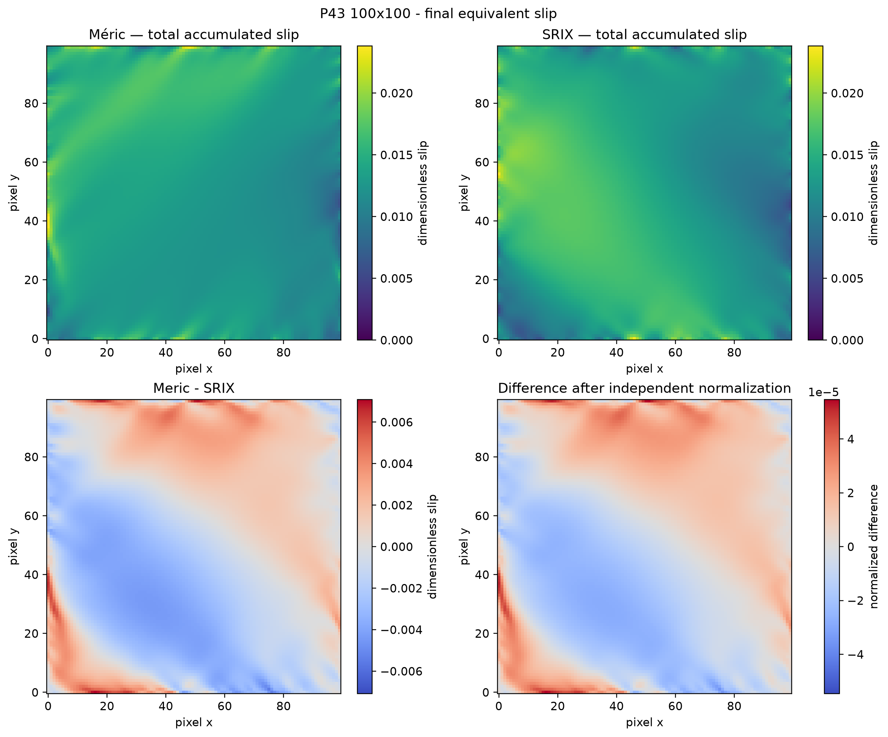
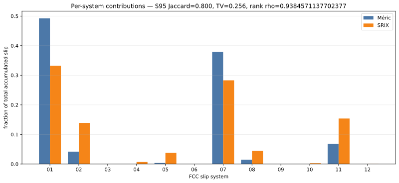
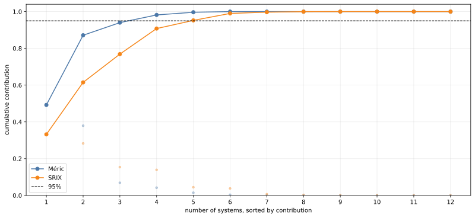
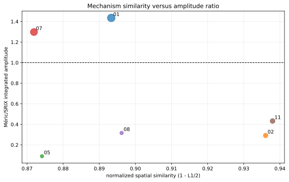
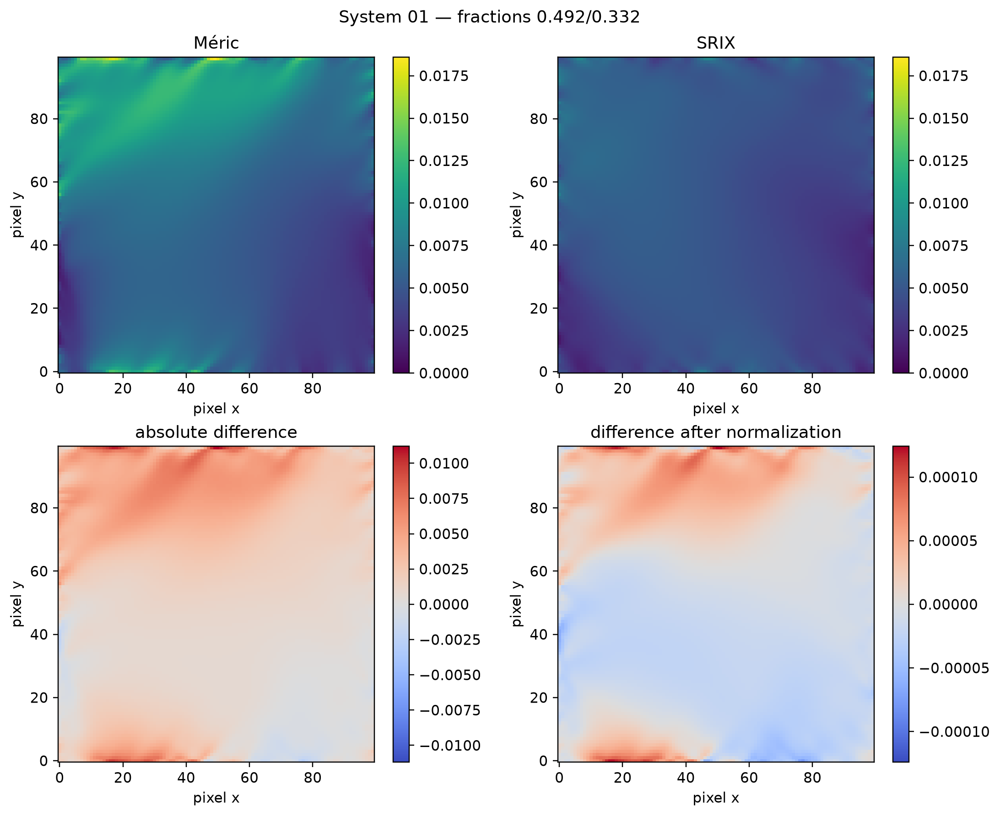
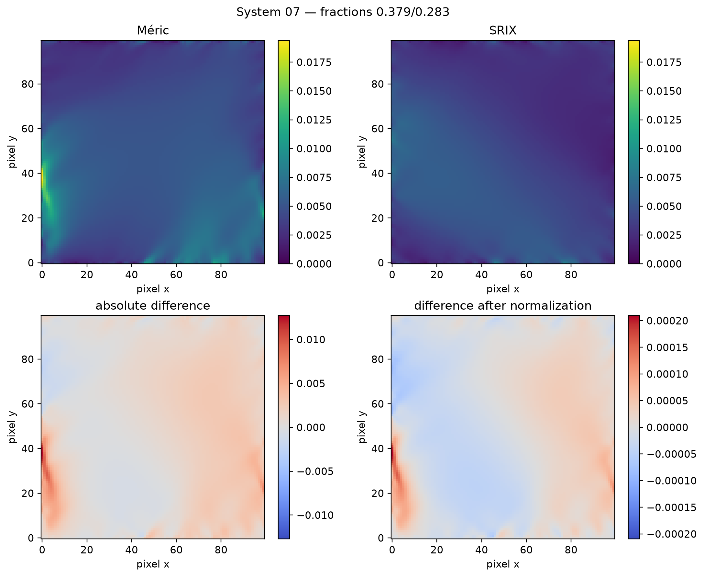

# SRIX/Méric P43 slip-system comparison

## Scientific question

The large difference in plastic-slip amplitude between the Méric--Cailletaud
and Forest--Rubin SRIX calculations does not by itself show whether the laws
select different crystal mechanisms. This comparison separates four questions:

1. which FCC systems carry the plastic slip;
2. whether their global ranking is preserved;
3. whether their spatial localization is preserved after amplitude
   normalization;
4. whether the remaining difference is mainly a change of intensity or a
   redistribution between systems.

The analysis is a post-processing comparison. It does not modify either
constitutive behaviour.

## Controlled comparison

The archived fields use the same P43 crop, a `100 x 100` pixel mesh, the same
homogeneous Bunge orientation `[35, 20, 15]` degrees, the same paired 316L
backbone, and the same twelve FCC systems in MFront order. Both calculations
use two TRI2 states per pixel and the same proportional path represented by 16
increments. The two flow rules are the controlled constitutive difference.

The two TRI2 states are averaged at pixel level exactly as in the existing
slip-map artefacts. The source archives contain final per-system fields, but no
per-system history for the sixteen increments. Consequently, this page makes
no claim about the chronology of activation.

:::{admonition} Scope of the evidence
:class: note

The comparison is authorized for fields on the registered path. It is not a
performance comparison, and it is not a material-identification result.
:::

## Global amplitude



The spatial integrals of the total accumulated per-system slip are `135.1952`
for Méric and `139.6654` for SRIX, giving a Méric/SRIX ratio of `0.9680`.
The median ratio is `0.9461` and the 95th-percentile ratio is `0.9370`.
These values describe the global intensity. They do not establish that the
same systems are active.

## Global system distribution



The principal system is system 01 for both laws. The top three systems are
the same (01, 07 and 11). The 95-percent cumulative sets are:

| quantity | Méric | SRIX |
|---|---:|---:|
| `S95` | 01, 07, 11, 02 | 01, 07, 11, 02, 08 |
| `S5` | 01, 07, 11 | 01, 02, 07, 11 |

Their Jaccard indices are `0.800` for `S95` and `0.750` for `S5`; the top-3
overlap is `3/3`. The total-variation distance between the twelve-component
fraction vectors is `0.2565`, the cosine similarity is `0.9441`, and the
Spearman rank correlation is `0.9231`.



The common principal systems indicate a shared dominant hierarchy, while the
non-zero distribution distance and the additional SRIX system in `S95` show
that the activity is not related by one global scale factor.

## Spatial localization



For the total accumulated slip field, the absolute relative L2 difference is
`0.1745`. After independent normalization by each field integral, the cosine
similarity is `0.9862` and the L1 distance is `0.1435`. Thus the broad spatial
shape is similar, although the overlap of the ten-percent highest-activity
supports is only `0.1468` for the total field.

The dominant systems should still be inspected individually. The following
two plates show systems 01 and 07; the complete gallery is stored with the
generated evidence.





For systems with a non-negligible field in both laws, the normalized spatial
cosines are high for the principal systems (system 01: `0.9684`; system 07:
`0.9545`; system 11: `0.9885`). The corresponding ten-percent support IoUs
are much lower (system 01: `0.2706`; system 07: `0.1751`; system 11:
`0.1062`). Correlation of broad maps therefore does not imply identical
high-activity zones.

## Interpretation

The archived result is closest to the following classification:

> Méric and SRIX share the dominant FCC slip-system hierarchy on the archived
> homogeneous-orientation P43 path, but redistribute activity and do not assign
> the same spatial amplitudes. The result is not compatible with describing the
> difference as a pure global scale factor.

This is a statement about the registered calculation. It does not claim that
the two laws are equivalent, nor that they select the same systems for every
orientation or loading path.

## Limitations

* `R` is an analytical Forest--Rubin transposition, not a direct identification
  on the P43 material.
* The Méric 16-increment calculation is numerically converged, but it is not a
  temporal-convergence study.
* The physical duration of the DIC loading is not documented.
* The orientation in this comparison is homogeneous; no real EBSD orientation
  map is used.
* The source archives contain final per-system fields only. Incremental
  contributions, activation order and signed slip histories are unavailable,
  so no chronology is inferred here.
* Agreement in dominant systems does not validate the amplitudes of stress,
  strain or internal variables.

## Reproduction

From the repository root, regenerate the JSON, CSV files and all figures with:

```bash
python scripts/compare_srix_meric_slip_maps_p43.py \
  --meric-report validation/_generated/performance/crystal_tet2_meric_p43_m100_slip_maps.json \
  --srix-report validation/_generated/performance/crystal_tet2_srix_p43_m100_16_slip_maps.json \
  --output-dir validation/_generated/performance/srix_meric_p43_m100_16_slip_maps \
  --docs-assets-dir docs/_static/spectral_mechanics/srix_meric_p43
```

The output records the report and field-file SHA-256 digests, mesh, crop,
orientation, paired parameter set, system order, thresholds and the explicit
absence of incremental history. The detailed numerical outputs are
`comparison_summary.json`, `system_metrics.csv` and `spatial_metrics.csv`.
