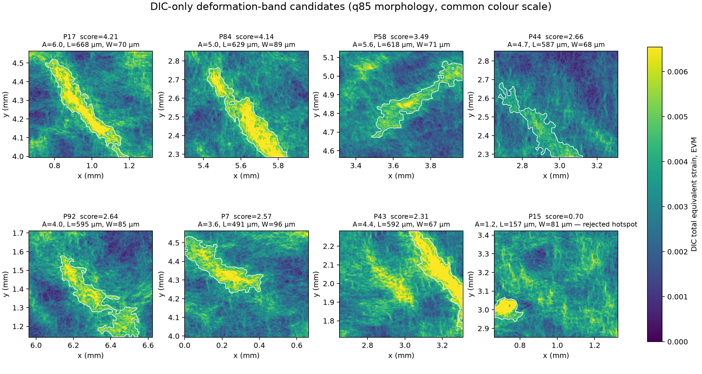

# Run the coupled P154 campaign

This guide runs the pre-registered reduced-ROI campaign. Read
{doc}`../explanation/micromorphic_plasticity` first for the model and
transaction rules.

## 1. Build and test the MFront behaviours

Source the pinned TFEL/MGIS environment, compile all four behaviours, and run
the MFront tests:

```bash
source "$HOME/.local/share/tfel/env/env.sh"
bash scripts/build_mfront.sh
MFRONT_BEHAVIOUR_LIBRARY=build/mfront/src/libBehaviour.so \
  .venv/bin/pytest -q -m mfront
```

The coupled campaign requires PyPardiso. Confirm the active sparse backend:

```bash
.venv/bin/fem-inhouse backend
```

## 2. Run the local P154 reference

P154 belongs to a `20 × 20` decomposition. The validation profile contains a
`180 × 155` core and a `436 × 411` solved grid with 128 pixels of padding.

```bash
.venv/bin/fem-inhouse --verbose partition \
  --input data/processed/case_study \
  --output results/constitutive-local-p0154-pad128 \
  --parts-x 20 \
  --parts-y 20 \
  --padding 128 \
  --increments 20 \
  --constitutive-backend mfront-native-plane-stress \
  --partition-id 154 \
  --mfront-threads 8
```

The partition writer saves every field atomically and writes `status.json`
last. Repeating the command reuses a complete partition whose manifest and
output hashes still match.

## 3. Derive the coupling sweep

Compute

$$
H_{\mathrm{ref}}
=\operatorname{median}_{e\in\text{plastic core}}
\left(K_e n p_e^{n-1}\right),
\qquad p_e>p_0.
$$

```bash
.venv/bin/fem-inhouse estimate-nonlocal-reference \
  --input data/processed/case_study \
  --campaign results/constitutive-local-p0154-pad128 \
  --partition-id 154 \
  --output results/constitutive-local-p0154-pad128/HREF.json \
  --alphas 0 0.25 0.5 1 2
```

`HREF.json` records the source hashes, plastic element count, derivative
quartiles, \(H_{\mathrm{ref}}\), and every
\(H_\chi=\alpha H_{\mathrm{ref}}\). Do not edit or recompute the selected
candidate after inspecting DIC metrics.

## 4. Run a smoke profile

Use 64 pixels of padding only to verify compilation, transactions, and
convergence. It is not valid scientific evidence at
\(\ell=58.88\,\mu\mathrm m\).

Replace `<HCHI_MPA>` with a value from `HREF.json`:

```bash
.venv/bin/fem-inhouse --verbose partition \
  --input data/processed/case_study \
  --output results/constitutive-nonlocal-p0154-smoke-a050 \
  --parts-x 20 \
  --parts-y 20 \
  --padding 64 \
  --increments 5 \
  --constitutive-backend mfront-native-plane-stress \
  --nonlocal-plasticity \
  --nonlocal-length-um 58.88 \
  --nonlocal-coupling-modulus-mpa <HCHI_MPA> \
  --nonlocal-relaxation 0.5 \
  --nonlocal-tolerance 1e-6 \
  --nonlocal-max-iterations 15 \
  --partition-id 154 \
  --mfront-threads 8
```

Check `nonlocal_coupling_failures`, cutbacks, the maximum Helmholtz residual,
iteration counts, and finite output arrays before launching the validation
profile.

## 5. Run the validation profile

Use 128 pixels of padding and 20 increments:

```bash
.venv/bin/fem-inhouse --verbose partition \
  --input data/processed/case_study \
  --output results/constitutive-nonlocal-p0154-pad128-a050 \
  --parts-x 20 \
  --parts-y 20 \
  --padding 128 \
  --increments 20 \
  --constitutive-backend mfront-native-plane-stress \
  --nonlocal-plasticity \
  --nonlocal-length-um 58.88 \
  --nonlocal-coupling-modulus-mpa <HCHI_MPA> \
  --nonlocal-relaxation 0.5 \
  --nonlocal-tolerance 1e-6 \
  --nonlocal-max-iterations 15 \
  --partition-id 154 \
  --mfront-threads 8
```

Use distinct output directories for every alpha. The immutable manifest
includes all nonlocal parameters and prevents accidental campaign reuse.

## 6. Validate raw coupled fields

After a coupled validation campaign has completed, compare it with the local
campaign using the pre-registered P154 criteria:

```bash
.venv/bin/fem-inhouse validate-coupled-nonlocal \
  --input data/processed/case_study \
  --local-campaign results/constitutive-local-p0154-pad128 \
  --coupled-campaign results/constitutive-nonlocal-p0154-pad128-a050 \
  --partition-id 154 \
  --output results/constitutive-nonlocal-p0154-pad128-a050/validation.json
```

The command verifies campaign compatibility and saved-field hashes before
loading the arrays. It reconstructs `EVM_HISTORICAL` independently from the
DIC, local FEM, and coupled FEM displacements, then evaluates every metric on
the manifest-declared core. It also checks the displacement error, all three
plane-stress residual components, required finite fields, and the frozen
acceptance thresholds.

`validation.json` states both
`post_filter_applied: false` and
`mechanical_solution_modified_by_candidate: true`. A non-zero exit code means
that at least one scientific criterion failed; it does not mean that the
calculation or report generation failed.

For the smoke sweep, the `Hchi=0` coupled campaign may be used as the
mechanically local reference because it has the same 64-pixel layout and
five-increment schedule. The final scientific comparison must use the local
128-pixel, 20-increment reference.

## 7. Inspect the coupled fields

In addition to the historical and complete-tensor outputs, a coupled
partition contains:

```text
PEEQ_NONLOCAL.npy
PEEQ_MISMATCH.npy
NONLOCAL_HARDENING_MPA.npy
YIELD_SURFACE_RADIUS_MPA.npy
NONLOCAL_RESIDUAL.npy
```

Metrics must be computed on the `180 × 155` core from the manifest, never on
the complete padded array. The primary comparison uses raw coupled FEM EVM
against DIC EVM. Do not Helmholtz-filter the final EVM field before reporting
the primary acceptance metrics.

## 8. Freeze and transfer

Select one alpha using the pre-registered P154 criteria in
`validation/nonlocal_p154_preregistration.md`. Record the criterion and the
selected value. Apply the same \(\ell\) and \(H_\chi\), without adjustment, to
P42 or P48.

The completed validation sweep is reported in
`validation/nonlocal_p154_validation_results.md`. No tested value passed all
criteria: `alpha=2` passed seven of eight but predicted `21.85%` active area
at the absolute DIC-q90 threshold, above the registered `20%` maximum.
Therefore no transfer parameter is frozen in the current campaign. The
`alpha=2` fields remain the best diagnostic candidate, not a validated
material calibration. Do not launch or label a P42/P48 run as confirmatory
without a new prospective protocol.

The condensed 3D backend is a reduced verification run:

```bash
--constitutive-backend mfront-3d-condensed-plane-stress
```

It should reproduce the native plane-stress result on a reduced case, but it
is not the production path for the P154 sweep.

## 9. Select a heterogeneous DIC ROI before calibrating alpha

The former P154 ROI is retained as a reproducibility example, but its DIC EVM
is unusually homogeneous. Selecting alpha there can therefore produce an
artificial monotone improvement as coupling increases. First rank all DIC
partitions without using any FEM result:

```bash
.venv/bin/fem-inhouse select-dic-partition \
  --input data/processed/case_study \
  --output validation/dic_partition_heterogeneity_10x10.json \
  --parts-x 10 --parts-y 10 --padding 150
```

The initial kurtosis-only scan selected P15, but visual inspection showed that
it contains an isolated hotspot rather than a deformation band. That criterion
is therefore rejected for length identification. The current 10 x 10 scan
ranks coherent q85 components by aspect ratio, occupied area, contrast, and
boundary contacts. The numerical score ranks P17 first, but this is a
screening result rather than an automatic scientific decision.

The mandatory visual review selects **P43**, index `(4, 3)`, for the next
coupled campaign. Its `360 x 310` core spans global element coordinates
`x=[1440,1800)` and `y=[930,1240)`, or
`x=[2.6496,3.3120] mm` and `y=[1.7112,2.2816] mm`. It contains two distinct
diagonal high-strain bands and is therefore better suited to testing both a
characteristic width and the effect of coupling strength. The automated score
penalises its boundary contacts, but those contacts do not outweigh the
scientific value of its internal two-band structure. Do not use P154, P15, or
an automated rank alone as evidence that a material length has been
identified.



The white contour is the dominant q85 component used only for morphological
ranking. All panels share the same EVM colour scale. The reported width is the
component area divided by its principal-axis extent; it is a reproducible
selection diagnostic, not yet an identified material length.

Before launching P43, the micromorphic constitutive hot path was benchmarked
on the complete P43 core with:

```bash
source /home/jeff/.local/share/tfel/env/env.sh
.venv/bin/python scripts/benchmark_nonlocal_constitutive_path.py \
  --input data/processed/case_study \
  --library build/mfront/src/libBehaviour.so \
  --partition-id 43 --parts-x 10 --parts-y 10 --padding 0 \
  --mode lightweight \
  --output results/performance/nonlocal-hot-path-p0043/lightweight \
  --threads 8 --length-scale-mm 0.05888 \
  --coupling-modulus-mpa 6000 \
  --overwrite
```

Run the same command with `--mode legacy` and a separate output directory for
the paired reference. The benchmark is intentionally configured from the CLI;
no partition number is embedded in the implementation. The recorded P43
result is `14.36 -> 7.61 s` and `796,856 -> 564,508 KiB`, with identical
hashes for in-plane stress, tangent, PEEQ, and \(\chi\). See
{doc}`../reference/results` for the complete-solver gate that was run before
the costly P43 campaign.

## 10. Plot the alpha comparison

Once the four complete campaigns are available, generate the comparative
maps and publication-ready vector figures:

```bash
.venv/bin/fem-inhouse plot-coupled-alpha-fields \
  --input data/processed/case_study \
  --local-campaign results/constitutive-local-p0154-pad128 \
  --campaign-a050 results/constitutive-nonlocal-p0154-pad128-a050 \
  --campaign-a100 results/constitutive-nonlocal-p0154-pad128-a100 \
  --campaign-a200 results/constitutive-nonlocal-p0154-pad128-a200 \
  --partition-id 154 \
  --output validation/figures/p154-alpha-comparison \
  --include-optional-fields
```

The command verifies all four manifests and saved-field hashes, reconstructs
the DIC and FEM `Total equivalent strain, EVM` fields from nodal displacement,
and crops only after loading the padded solutions. It writes PNG, PDF, and
SVG versions of the EVM comparison, FEM-minus-DIC error maps, PEEQ maps,
PEEQ distributions, and a compact summary. The common colour limits and
metrics are recorded in `plot_metadata.json`.

The main EVM figures contain raw converged FEM fields. No Helmholtz filtering
is applied before plotting or comparing them. `PEEQ` remains an internal
plasticity variable; the figures do not claim an experimental PEEQ field.
Optional micromorphic fields are plotted only when
`--include-optional-fields` is supplied. The local alpha=0 control uses
explicit zero/Hchi=0 fallback values for those optional fields, and this is
recorded in the metadata.

### Recorded P154 figures

The committed reference campaign is displayed below. These maps use the raw
converged fields and the common colour limits recorded in
`plot_metadata.json`.

```{figure} ../../validation/figures/p154-alpha-comparison/p154_total_evm_comparison.png
:name: p154-alpha-total-evm
:alt: DIC and FEM total equivalent strain for the four coupling levels
:align: center

Total equivalent strain reconstructed from DIC and FEM displacements.
```

```{figure} ../../validation/figures/p154-alpha-comparison/p154_total_evm_difference.png
:name: p154-alpha-evm-error
:alt: FEM minus DIC total equivalent strain for the four coupling levels
:align: center

Signed FEM-minus-DIC EVM errors, with one symmetric scale shared by all four
coupling levels.
```

```{figure} ../../validation/figures/p154-alpha-comparison/p154_peeq_comparison.png
:name: p154-alpha-peeq
:alt: PEEQ maps for the four coupling levels
:align: center

PEEQ redistribution. PEEQ is an internal variable, not an experimental DIC
observable.
```

The complete PNG, PDF, SVG, optional-field figures, and reproducibility
metadata are kept in
`validation/figures/p154-alpha-comparison/`.

### Recorded P43 figures

P43 uses the generic repeated campaign option because its registered sweep is
alpha = 0, 1, 2, 4:

```bash
.venv/bin/fem-inhouse plot-coupled-alpha-fields \
  --input data/processed/case_study \
  --local-campaign results/constitutive-local-p0043-pad150 \
  --coupled-campaign 1 results/constitutive-nonlocal-p0043-pad150-a100 \
  --coupled-campaign 2 results/constitutive-nonlocal-p0043-pad150-a200 \
  --coupled-campaign 4 results/constitutive-nonlocal-p0043-pad150-a400 \
  --partition-id 43 \
  --output validation/figures/p0043-alpha-comparison \
  --strain-vmax-percentile 99.5 \
  --peeq-vmax-percentile 99.5 \
  --difference-vmax-percentile 99.5
```

```{figure} ../../validation/figures/p0043-alpha-comparison/p0043_total_evm_comparison.png
:name: p0043-alpha-total-evm
:alt: P43 DIC and raw FEM total equivalent strain for alpha 0, 1, 2 and 4
:align: center

P43 raw total equivalent strain. The two diagonal FEM structures broaden as
the energetic coupling increases.
```

```{figure} ../../validation/figures/p0043-alpha-comparison/p0043_peeq_comparison.png
:name: p0043-alpha-peeq
:alt: P43 internal PEEQ fields for alpha 0, 1, 2 and 4
:align: center

P43 PEEQ redistribution on one common scale. The peak falls strongly while
the mean changes much less.
```

All positive candidates pass the registered checks. Alpha 2 maximises top-10%
IoU, whereas alpha 4 gives the best correlation, relative L2 and absolute
DIC-q90 IoU. Neither value is frozen because the tested set does not define a
unique optimum and the length was held fixed. The numerical record is
`validation/nonlocal_p0043_validation_results.md`.

### P15 alpha = 0, 1, 2, 4 diagnostic

The same plotting workflow supports a registered four-value sweep through the
repeated CLI option. The completed P15 diagnostic is stored in
`validation/figures/p0015-alpha-comparison/`, with
`p0015_total_evm_comparison.*`, `p0015_total_evm_difference.*`, and
`p0015_peeq_comparison.*`. It uses `ell = 58.88 micrometres`,
`padding = 64`, and `alpha = (0, 1, 2, 4)`.

For this run, RMSE decreases from `3.454e-3` at alpha=0 to `2.187e-3` at
alpha=4, but Pearson correlation remains negative (approximately `-0.15`).
The result therefore demonstrates attenuation of the localized FEM field, not
an accepted FEM-DIC spatial match. More importantly, the DIC structure is an
isolated hotspot: P15 was selected by kurtosis, which is blind to morphology,
and is not suitable for identifying a band width. Because the
padding-to-length ratio is also below four, this campaign is retained only as a
negative diagnostic and must not be interpreted as a material-length
identification. No further alpha sweep should be launched on P15.
