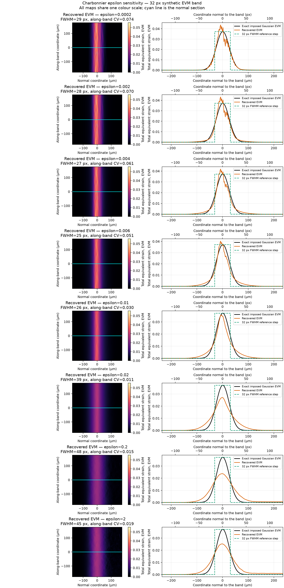
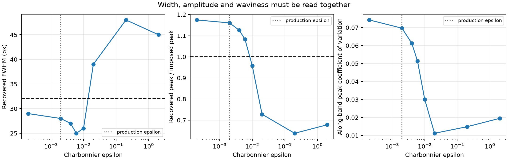

# DISFlow epsilon sensitivity on the 32 px synthetic band — results

Date: **2026-07-29**

Preregistration:
[`dic_epsilon_band32_preregistration.md`](dic_epsilon_band32_preregistration.md)

Evidence ID: **E-DIC-002**

## Result

Changing the Charbonnier epsilon materially changes the recovered EVM band,
but it does not remove the along-band waviness independently of the normal
profile.

- At the production value `epsilon=0.002`, the recovered FWHM is 28 px, peak
  gain is 1.161 and along-band peak CV is 0.070.
- At `epsilon=0.01`, the peak is nearly unbiased (gain 0.958) and waviness is
  reduced to CV 0.030, but the band narrows further to 26 px.
- At `epsilon=0.02`, waviness nearly disappears (CV 0.011), but the band
  broadens to 39 px and the peak falls to 0.728.
- Larger values remain over-smoothed: 45--48 px FWHM and peak gains below
  0.68.

The lowest profile L2 error occurs near `epsilon=0.006`, but this is not a
parameter selection: its band is only 25 px wide and its along-band CV remains
0.051.

## Conclusion

Yes, epsilon changes the visible problem strongly. Around `0.01` it reduces
much of the speckle-aligned waviness without suppressing the EVM peak.
However, it simultaneously increases the width bias in the opposite
direction: the 32 px band is recovered at 26 px.

At `0.02` and above, the apparent visual improvement is mainly
over-regularisation. It cannot be called a better measurement because the
band becomes too broad and too weak. No epsilon is selected from this
exploratory single-band test.
