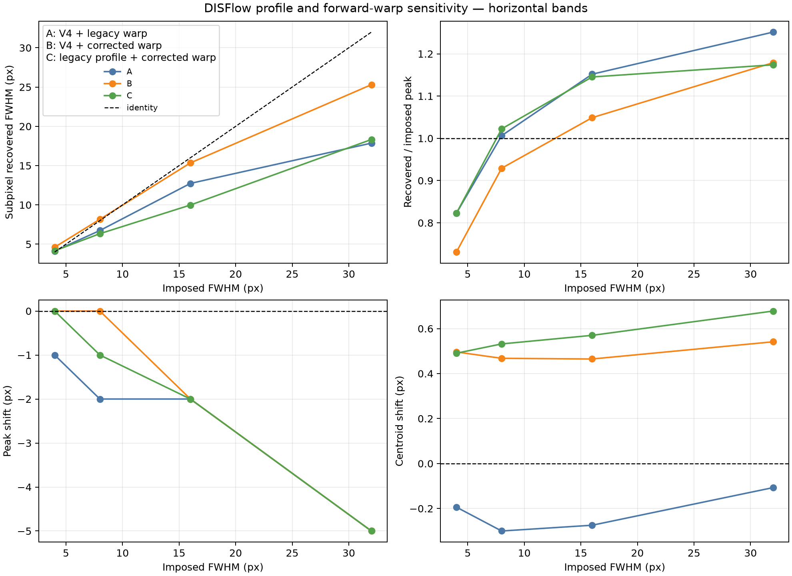

# Declared versus legacy DISFlow profile comparison — results

Date: **2026-07-29**

Preregistration:
[`dic_legacy_profile_comparison_preregistration.md`](dic_legacy_profile_comparison_preregistration.md)

Status: **completed**

## What was compared

| Case | DISFlow profile | Forward-image warp |
|---|---|---|
| A | declared V4: medium, patch 8, stride 3, GD 30 | historical one-step approximation |
| B | declared V4 | iteratively inverted forward displacement |
| C | setters from the supplied 2021 script | iteratively inverted forward displacement |

All cases use native scale 0, Charbonnier epsilon 0.002, the same central
synthetic window and the same all-valid declared mask. No mechanical solve and
no non-local parameter identification was performed.

## OpenCV values actually obtained

The declared V4 profile returns exactly its requested values. With OpenCV
4.14, the no-argument factory used by the legacy script returns:

```text
gradient-descent iterations = 16
mean normalisation = true
spatial propagation = true
```

after the explicitly requested patch size 4, stride 1, finest scale 0 and
variational settings have been applied. These are **OpenCV 4.14 factory
values**, not certified historical values.

## Null diagnostic

| Case | spurious EVM RMS | ratio to final DIC RMS | correlation scale |
|---|---:|---:|---:|
| A | 1.363e-4 | 4.52 % | 38.21 px |
| B | 1.363e-4 | 4.52 % | 38.21 px |
| C | 1.637e-4 | 5.42 % | 37.94 px |

The warp has no role in this measured-image pair, so A and B are identical.
The smaller legacy patches increase the null EVM RMS by about 20 %, while it
remains small relative to the final DIC field.

## Sinusoidal transfer

| Case | horizontal MTF-50 | vertical MTF-50 |
|---|---:|---:|
| A | 49.47 px | 49.18 px |
| B | 49.86 px | 49.56 px |
| C | 55.92 px | 55.50 px |

Correcting the warp changes the MTF-50 by less than one pixel. The legacy
script profile crosses 50 % at a wavelength about 6 px larger, meaning that
it attenuates a wider range of short wavelengths in this OpenCV 4.14
environment.

## Band metrology

The figure separates the warp effect (A to B) from the profile effect (B to
C). It shows horizontal bands; the machine-readable table contains both
orientations.



For the 32 px horizontal band:

| Case | legacy integer FWHM | subpixel FWHM | peak gain | peak shift | centroid shift |
|---|---:|---:|---:|---:|---:|
| A | 28 px | 17.86 px | 1.251 | -5 px | -0.11 px |
| B | 28 px | 25.31 px | 1.179 | -5 px | +0.54 px |
| C | 26 px | 18.33 px | 1.174 | -5 px | +0.68 px |

The old integer metric spans the first and last samples above half-height. It
can bridge shoulders or local dips and therefore reports 28 px for both A and
B. The new subpixel metric starts at the actual maximum and finds the nearest
left and right crossings. It exposes the profile deformation that the integer
count hid.

The corrected forward inverse materially improves the recovered widths for
the V4 profile: 4, 8, 16 and 32 px horizontal bands become approximately
4.62, 8.17, 15.35 and 25.31 px. The legacy profile produces approximately
4.16, 6.34, 9.98 and 18.33 px. Thus the missing inverse was not a negligible
implementation detail for localized bands, even though it barely moved the
sinusoidal MTF.

Peak and centroid shifts are deliberately distinct:

- the peak moves in integer sample steps and is sensitive to local shoulders;
- the centroid is a barycentre after subtracting the profile minimum and is
  subpixel;
- neither is labelled as the other in new artefacts.

## V4 non-regression

Case A reproduces the V4 queried settings, null RMS, MTF-50 values and legacy
integer widths:

```text
horizontal legacy widths: 4, 7, 12, 28 px
vertical legacy widths:   4, 7, 13, 28 px
```

The new files add corrected metrics; they do not overwrite V4.

## Decision for V3

The `legacy_script_2021` profile is retained as the **primary provenance
profile** for V3 because its explicit setters match the supplied historical
source. The `declared_medium_v4` profile remains the required sensitivity.
This decision was made without reference to a FEM/DIC agreement score.

The nominal warp for both profiles is `iterative_forward_inverse`.

## Claim boundary

Supported:

- V4 is reproducible;
- the approximate inverse biases localized-band metrology;
- the two DISFlow profiles have measurably different transfer functions;
- OpenCV 4.14 factory defaults can be recorded exactly.

Not demonstrated:

- bitwise reproduction of the historical OpenCV executable;
- reproduction of the unavailable historical mask;
- that either profile is physically more accurate because of a lower FEM/DIC
  error;
- any revised value of the micromorphic parameters.
