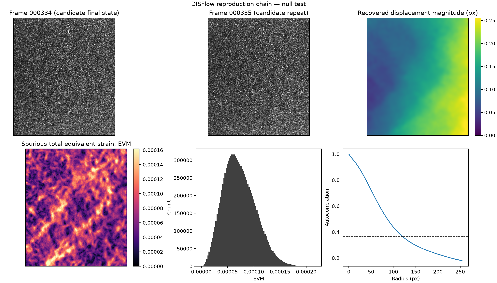
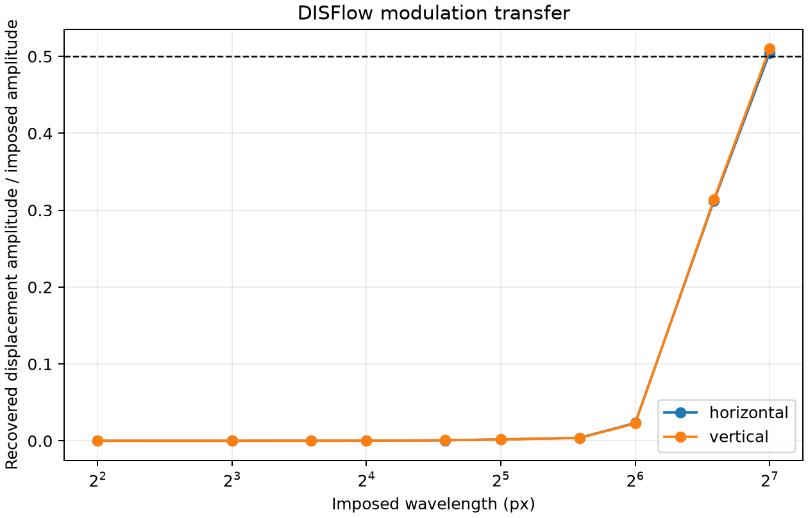
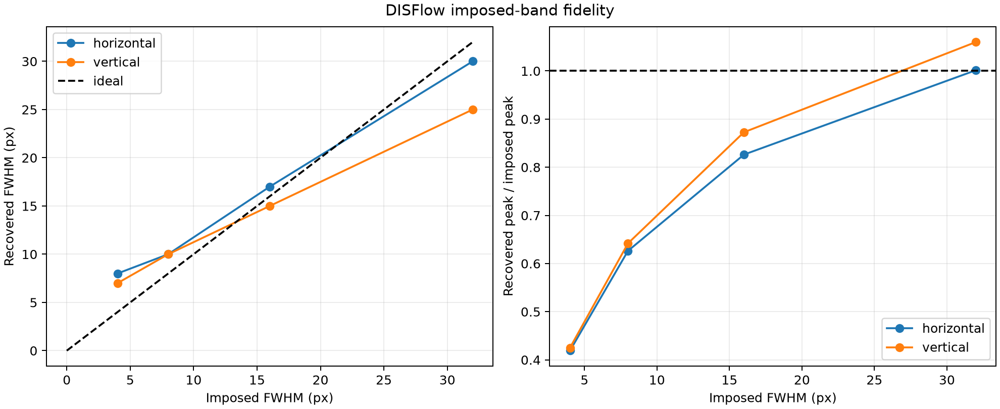

# DIC measurement-chain characterisation — results

Date: **2026-07-29**

Preregistration:
[`dic_measurement_chain_preregistration.md`](dic_measurement_chain_preregistration.md)

Evidence ID: **E-DIC-001**

## Status and claim boundary

The pre-registered V2.1 and V2.2 computations are complete for the declared
OpenCV 4.14 reproduction implementation.

This is **not** a bitwise reproduction of the historical DISFlow executable:
its OpenCV version, preset and remaining defaults were not archived. The
reported variational parameters, including Charbonnier
\(\epsilon=0.002\), are applied.

The mapping of `000334.tif` and `000335.tif` to a repeated final state remains
provisional without the acquisition log. The result below is therefore a
noise-and-drift **upper bound**, not a certified camera/DIC noise floor.

## Candidate-repeat result

| Quantity | Value |
|---|---:|
| centred column-displacement standard deviation | 0.0688 px |
| centred row-displacement standard deviation | 0.0348 px |
| spurious EVM RMS | \(7.895\times10^{-5}\) |
| step-40 DIC EVM RMS, same operator | \(3.019\times10^{-3}\) |
| RMS ratio | **2.62 %** |
| EVM autocorrelation \(1/e\) crossing | 119.8 px = 220.4 µm |
| warped photometric-residual RMS | 1.835 grey levels |

The RMS ratio lies in the pre-registered “small” band. However, the recovered
flow and EVM are visibly coherent over large distances. The 120 px
autocorrelation scale is evidence against interpreting this pair as pure
uncorrelated image noise. It can contain slow optical drift, a small real
loading increment or both.



## Sinusoidal transfer

The recovered displacement amplitude reaches 50 % of the imposed value only
at wavelengths of approximately:

- 127.2 px (234.1 µm) for the horizontal mode;
- 126.4 px (232.5 µm) for the vertical mode.

The response is nearly isotropic for these synthetic modes. Under the
reported high regularisation weight, short alternating wavelengths are
strongly suppressed.



## Imposed-width bands

| Imposed FWHM | Horizontal recovered | Vertical recovered |
|---:|---:|---:|
| 4 px | 8 px | 7 px |
| 8 px | 10 px | 10 px |
| 16 px | 17 px | 15 px |
| 32 px | 30 px | 25 px |

The 4 px band is broadened by 75--100 % and its peak falls to about 42 %.
The 8 px band is broadened to 10 px. A 16 px band is recovered within one
pixel in both orientations, with peak gains of 0.83 and 0.87. At 32 px, the
peak is recovered but the vertical width contracts to 25 px.



The band and sinusoidal tests are not contradictory. A localized strain band
is generated by an integrated displacement step and contains strong
low-frequency content; a zero-mean displacement sinusoid isolates one spatial
frequency. Both measurements are required to describe the observation
operator.

## Temporary scientific conclusion

1. The available final pair gives a small EVM upper bound relative to the
   final DIC field, but it does not yet certify the random noise floor.
2. The measurement chain is demonstrably non-neutral in space.
3. A 32 px spatial scale is larger than the minimum band width recovered
   faithfully, but it is **not** automatically independent of the observation
   operator: width and orientation biases remain measurable.
4. The next mechanically meaningful comparison must pass FEM displacements
   through this declared image/flow chain (V3) before renewed
   \(H_\chi,\ell\) identification.
5. V2.3 must vary both DIS regularisation weight and epsilon; an alpha-only
   sensitivity study would not characterise the robust-penalty regime.

## Reproduction

```bash
.venv/bin/fem-inhouse characterise-dic-measurement-chain \
  --images /home/jeff/CNRS/Theses/Adil/essais/9_numerical/DIC_images \
  --prepared-case data/processed/case_study \
  --output validation/reference_data/dic_measurement_chain_v1 \
  --figure-output validation/figures/dic_measurement_chain_v1
```

Machine-readable values and exact source hashes are in
`validation/reference_data/dic_measurement_chain_v1/`.
