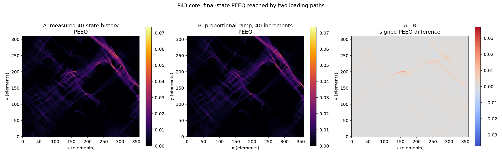

# P43 final-state path dependence on PEEQ — results

Date: 2026-07-30
Preregistration: `dic_multistep_p0043_path_dependence_preregistration.md`.
Primary machine-readable result:
`reference_data/dic_multistep_path_dependence_p0043_v1/report.json`.

## Short answer

**Path dependence is real, material and concentrated in the localisation
bands.** Relative L2 on core PEEQ between the measured 40-state history and the
proportional ramp to the same endpoint is `15.82 %`, in the registered
"present but not dominant" band.

The measured path accumulates **more** plasticity, and the excess grows with
the PEEQ level: `+4.9 %` on the mean, `+9.7 %` at the 99th percentile,
`+14.8 %` at the maximum.

The registered discretisation veto does not fire, by a wide margin, and the
excess is not a diffuse noise ratchet.

## Fields

Both runs end on a bit-identical prescribed boundary displacement, so the
interior difference is path dependence, not a difference in what was imposed.
All metrics are on the core `360 x 310`, padding excluded.

| Label | Path | Increments | Newton iterations | Cutbacks | Wall time |
|---|---|---:|---:|---:|---:|
| A | measured 40-state DIC history | 40 | 469 | 3 | `68.1 min` |
| B | proportional ramp | 40 | 225 | 0 | `31.0 min` |
| C | proportional ramp, archived | 20 | — | — | — |

The measured path costs more than twice the Newton work of the proportional
ramp to the same endpoint. That is itself a signal that it traverses a
different plastic history.

## Registered metrics

| Metric | A vs B (path) | B vs C (discretisation) |
|---|---:|---:|
| relative L2 | `0.158169` | `0.00201738` |
| RMSE | `8.84757e-04` | `1.12954e-05` |
| signed mean difference | `+1.51802e-04` | `-1.64023e-06` |
| maximum absolute difference | `3.68877e-02` | `1.91934e-04` |
| Pearson correlation | `0.987261` | `0.999998` |
| top-10 % IoU | `0.863105` | `0.997852` |
| activity disagreement at `1e-4` | `1.81 %` | `0.046 %` |

Descriptive PEEQ over the core:

| Field | mean | median | p99 | max |
|---|---:|---:|---:|---:|
| A measured | `3.2301e-03` | `1.4619e-03` | `2.5708e-02` | `7.3608e-02` |
| B proportional 40 | `3.0783e-03` | `1.4521e-03` | `2.3426e-02` | `6.4148e-02` |
| C proportional 20 | `3.0799e-03` | `1.4489e-03` | `2.3445e-02` | `6.4191e-02` |

## The discretisation control

Registered veto: the conclusion is withdrawn unless the B-C difference is at
least three times smaller than A-B.

`0.00201738 x 3 = 0.00605 <= 0.158169`. The control is **78 times** smaller
than the path effect. Increment count from 20 to 40 changes core PEEQ by
`0.20 %`; changing the loading path changes it by `15.82 %`. The veto does not
fire and the separation is not marginal.

## Noise ratchet or genuine non-proportionality

The registered caveat: PEEQ accumulates monotonically, so the DIC noise on the
measured path produces a one-sided bias estimated at `3.6 %` of the final EVM
RMS. A difference of that order could not be attributed to physics.

Two things rule the ratchet out as the dominant term.

**Magnitude.** `15.82 %` is `4.4` times the estimated ratchet.

**Structure.** The registered discriminator is the ratio of the mean signed
difference inside the top-10 % PEEQ set to the mean outside it. A diffuse,
noise-like excess gives a ratio near `1`.

> **band structure ratio = 13.11**

The excess is thirteen times stronger inside the bands than outside. The
difference map shows this directly: it is flat and near zero over almost the
whole core, with positive filaments tracing the localisation bands.



The noise contribution is **not subtracted**. Part of the `+4.9 %` mean excess
may still be ratchet. What the structure establishes is that the ratchet cannot
be the main term, because a ratchet has no reason to prefer the bands.

## Reading

The measured history pushes the localisation harder than a proportional ramp
that ends at the same place. The band morphology is largely preserved,
correlation `0.987`, but `13.7 %` of the top-decile set changes membership and
the peak value rises by `14.8 %`.

This is the expected signature of a non-proportional path in J2 plasticity: the
equivalent plastic strain is a path integral, so two paths sharing an endpoint
need not share it, and the divergence concentrates where the plastic
multiplier is largest.

### Consequence for the archived identification work

Every archived micromorphic campaign uses the proportional path. This result
puts a previously unaccounted systematic of about `16 %` on core PEEQ, and
`+14.8 %` on the peak, precisely where the band overlap metrics are evaluated.

It does **not** overturn the archived rankings. Those are separated by much
larger margins: the archived FEM-versus-DIC top-10 % IoU sits near `0.25` to
`0.30`, whereas the path-to-path IoU here is `0.863`. Path dependence is
material but smaller than the model-form and observation-operator gaps already
recorded. It should be carried as a known systematic, not treated as a
correction to apply.

## Claim boundary

This compares two **computed** fields under one constitutive model, sharing one
endpoint. It says nothing about which path the specimen actually followed:
there is no force synchronisation, the states are ordered image indices rather
than load fractions, and no unloading branch exists. PEEQ is not a DIC
observable and was never compared with a measured field here.

## Reproduction

```bash
fem-inhouse --verbose run-dic-multistep-mechanics \
  --prepared-case data/processed/case_study \
  --source-campaign results/constitutive-local-p0043-pad150 \
  --history validation/reference_data/dic_multistep_history_p0043_repaired_v1 \
  --partition-id 43 --mode proportional --record-newton-trace \
  --output validation/reference_data/dic_multistep_proportional40_p0043_v1

fem-inhouse compare-path-dependence \
  --measured validation/reference_data/dic_multistep_predictor_fix_p0043_v1 \
  --proportional validation/reference_data/dic_multistep_proportional40_p0043_v1 \
  --archived-field results/constitutive-local-p0043-pad150/partitions/0043/PEEQ.npy \
  --field PEEQ \
  --output validation/reference_data/dic_multistep_path_dependence_p0043_v1 \
  --figure-output validation/figures/dic_multistep_path_dependence_p0043_v1
```
