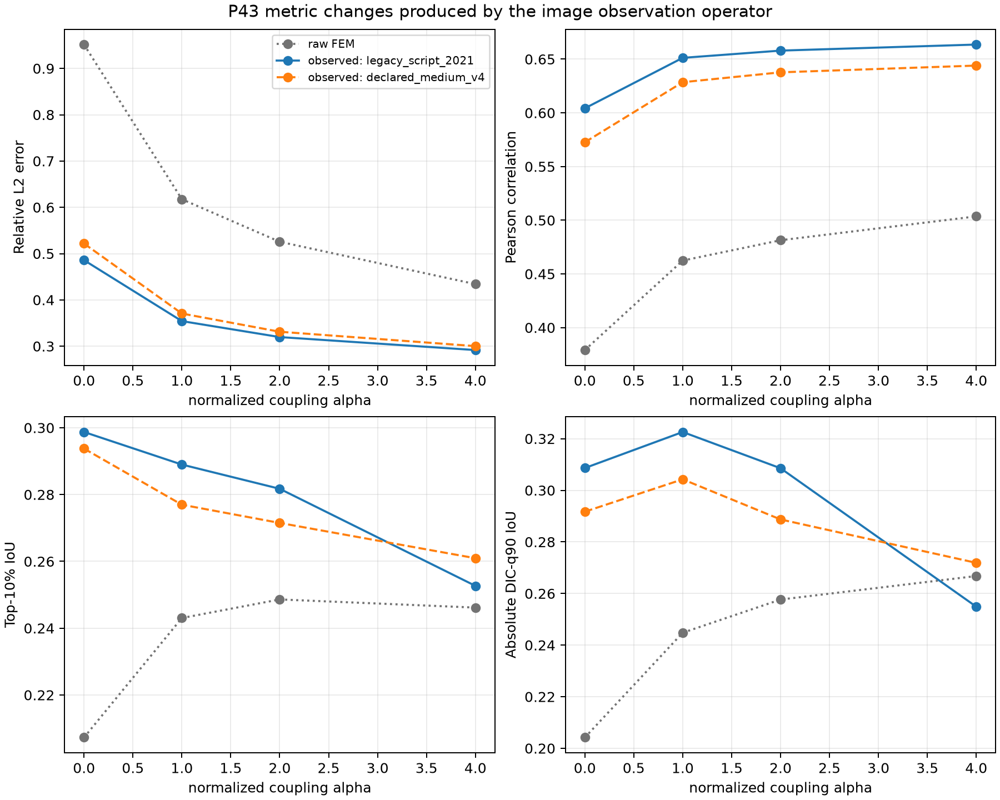
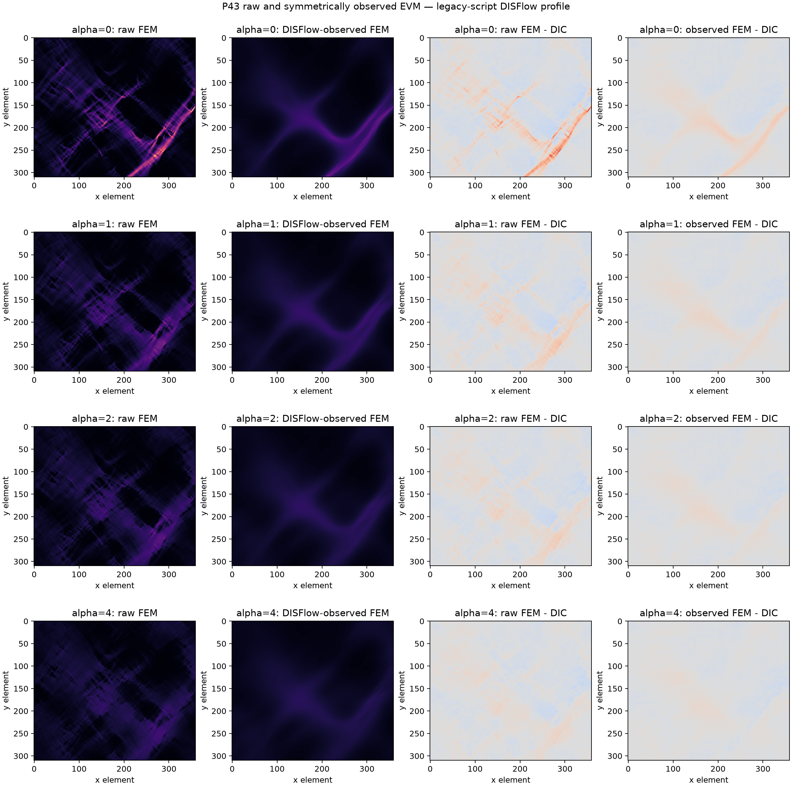
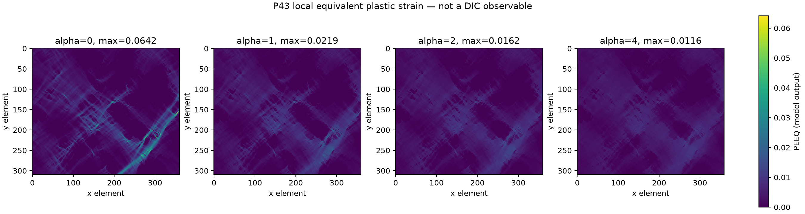

# Symmetric image-level observation on P43 — results

Date: **2026-07-29**

Preregistration:
[`dic_symmetric_observation_p0043_preregistration.md`](dic_symmetric_observation_p0043_preregistration.md)

Status: **eight archived-displacement replays completed**

## Result in one sentence

Passing FEM displacement through the declared DISFlow chain removes roughly
half of the apparent L2 discrepancy and strongly increases correlation, but it
also changes the localization ranking: alpha 4 remains best for amplitude
while alpha 1 is best for absolute-q90 overlap. Renewed micromorphic
identification is therefore **not yet authorised**.

## What V3 changes

The primary profile is `legacy_script_2021`, selected from source provenance.
The table compares the old raw-FEM metric with the image-observed FEM metric
on exactly the same P43 core.

| alpha | rel. L2 raw | rel. L2 observed | corr. raw | corr. observed | q90 IoU raw | q90 IoU observed | q90 active observed |
|---:|---:|---:|---:|---:|---:|---:|---:|
| 0 | 0.952 | 0.486 | 0.379 | 0.604 | 0.204 | 0.309 | 16.13 % |
| 1 | 0.617 | 0.354 | 0.462 | 0.651 | 0.245 | **0.323** | 15.00 % |
| 2 | 0.526 | 0.320 | 0.481 | 0.658 | 0.258 | 0.309 | 13.54 % |
| 4 | **0.434** | **0.292** | **0.504** | **0.664** | **0.267** | 0.255 | **10.26 %** |

The observed local-baseline RMSE falls from `3.988e-3` to `2.036e-3`.
This is not a mechanical improvement: the mechanical displacement is
unchanged. It measures the consequence of applying the image operator to the
prediction.

## Field evidence

The observed maps are visibly smoother than the raw FEM maps. Fine
cross-hatched structures present in raw EVM are not transmitted by DISFlow.
The signed error becomes smaller and smoother, especially at high coupling.

Every row uses common EVM and signed-error colour limits. Individual replay
directories additionally contain a five-field comparison with DIC and a fixed
central profile.

## Answers to the preregistered questions

### 1. Amplitude error explained by observation

For the primary profile, relative L2 is reduced by:

- 49 % for the local baseline;
- 43 % for alpha 1;
- 39 % for alpha 2;
- 33 % for alpha 4.

The asymmetry between raw FEM and measured DIC was therefore a major part of
the apparent amplitude error. It was not a small correction.

### 2. Width and morphology that persist

DISFlow suppresses much of the fine raw structure and broadens the dominant
smooth features. Nevertheless, it does not make the candidates equivalent:
their q90 active fractions and spatial overlaps remain distinct.

The local case still predicts 16.13 % active area above the DIC q90 threshold
instead of the 10 % reference fraction. The earlier 17.80 % raw value was
partly an observation-operator artefact, but the entire excess does not
disappear.

Alpha 4 reaches 10.26 % active area, yet its absolute-q90 IoU drops below
alpha 1 and alpha 2. Matching area by suppressing activity is therefore not
the same as placing the active band correctly.

### 3. Ranking

- amplitude and correlation improve monotonically through alpha 4;
- absolute-q90 localization peaks at alpha 1;
- relative top-10 % IoU peaks at the local case after observation
  (`0.299`), with alpha 1 close behind (`0.289`);
- the “best alpha” consequently depends on the scientific observable.

The observation operator strengthens, rather than removes, the conflict
between amplitude and localization objectives.

### 4. PEEQ redistribution

PEEQ is unchanged because no mechanics was rerun. The reduction of PEEQ peaks
with increasing alpha remains a valid mechanical fact, shown separately:

It is not an experimental PEEQ comparison and does not prove better band
placement.

### 5. Profile sensitivity

The declared V4 profile gives slightly weaker apparent agreement than the
primary legacy-source profile:

- local observed correlation: 0.573 instead of 0.604;
- alpha-4 observed correlation: 0.644 instead of 0.664;
- local observed relative L2: 0.522 instead of 0.486;
- alpha-4 observed relative L2: 0.300 instead of 0.292.

Both profiles yield the same qualitative conclusions. The spread is a
measurement-chain uncertainty, not a parameter-selection degree of freedom.

## Numerical integrity

- all four source `U.npy` hashes match their immutable `status.json`;
- all reference-image hashes are recorded;
- P43 solve and core bounds come only from manifests;
- the inverse warp converges in 4–5 iterations;
- its final residual is at most `9.995e-6 px`;
- the minimum forward-map Jacobian is at least 0.962;
- DIC, raw FEM and observed FEM use identical `360x310` element cores;
- no EVM post-filter is applied;
- no mechanical state or source campaign is modified.

## Scientific decision

**Do not resume a fit of `Hchi` and `ell` from the old objective surface.**

V3 changes the error scale substantially and changes the localization ranking.
Any future identification must:

1. use the image-level operator in its objective;
2. retain the two profiles as provenance/sensitivity, never tune them;
3. keep amplitude, relative localization and absolute-threshold localization
   separate;
4. include the uncertainty introduced by the unavailable historical OpenCV
   binary and mask;
5. pre-register a new parameter domain and decision rule.

The present result does not identify a material internal length.

## Claim boundary

Verified:

- archived P43 displacement can be replayed reproducibly through an
  image-level operator;
- raw-FEM versus DIC metrics materially overstate the discrepancy;
- the observation chain alters amplitude, morphology and candidate ranking.

Supported:

- the local model still leaves excess active background after symmetric
  observation;
- coupling redistributes mechanical plasticity, but stronger coupling is not
  uniformly better spatially.

Not demonstrated:

- bitwise historical DIC reproduction;
- a unique alpha, `Hchi` or `ell`;
- a transferable material length;
- that the legacy profile is more accurate because it scores better.
