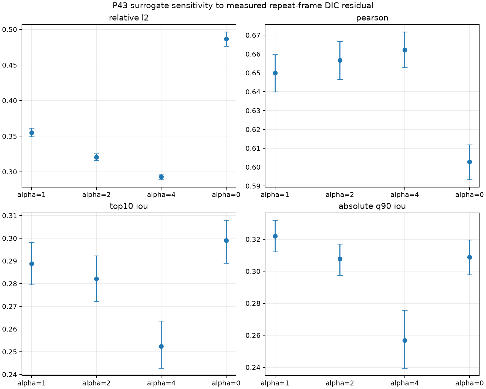
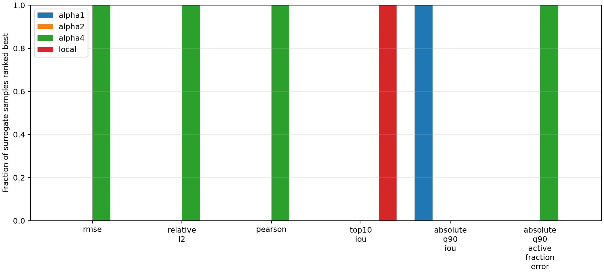

# P43 DIC uncertainty propagation

Date: 2026-07-29

Primary machine-readable result:
`reference_data/dic_uncertainty_propagation_p0043_v1/report.json`.

## Question

Does the residual measured between the repeated final images change the
scientific ranking of the archived P43 local and micromorphic fields after the
symmetric image-level observation?

This is a light sensitivity propagation. It does not rerun mechanics and its
intervals are not confidence intervals.

## Method

DISFlow was rerun once from `000334.tif` to `000335.tif` with the
source-derived `legacy_script_2021` profile. The measured component means were
removed. The remaining two-component residual was sampled through 256
uniformly drawn contiguous windows of the complete P43 solve-support size,
with a random sign and fixed seed `20260729`.

The initial preregistration specified periodic translations. A pilot exposed
an artificial seam when the support crossed the crop boundary. That invalid
pilot was rejected before versioning; the locked correction and its rationale
are recorded in
`dic_uncertainty_propagation_p0043_amendment.md`.

For every draw, the residual was added to the prepared nodal DIC displacement,
the common historical EVM was reconstructed, and the four immutable observed
FEM fields were rescored. No FEM state, PEEQ field or material parameter was
changed.

The regenerated residual standard deviations are:

| OpenCV component | Standard deviation |
|---|---:|
| column displacement | 0.06283 px |
| row displacement | 0.04267 px |

These reproduce the previously archived repeated-frame diagnostic.

## Sensitivity intervals

Values below are median and 2.5--97.5 % surrogate-sensitivity limits.

| Case | Relative L2 | Pearson correlation | top-10 % IoU | absolute-q90 IoU |
|---|---:|---:|---:|---:|
| local | 0.4866 [0.4763, 0.4965] | 0.6028 [0.5933, 0.6118] | 0.2990 [0.2890, 0.3079] | 0.3088 [0.2978, 0.3195] |
| alpha=1 | 0.3549 [0.3492, 0.3614] | 0.6499 [0.6400, 0.6598] | 0.2888 [0.2796, 0.2981] | 0.3222 [0.3122, 0.3318] |
| alpha=2 | 0.3205 [0.3159, 0.3254] | 0.6567 [0.6465, 0.6667] | 0.2821 [0.2721, 0.2922] | 0.3078 [0.2975, 0.3171] |
| alpha=4 | 0.2928 [0.2887, 0.2968] | 0.6621 [0.6528, 0.6717] | 0.2523 [0.2428, 0.2636] | 0.2569 [0.2395, 0.2757] |

## Ranking stability

Across all 256 draws:

- `alpha=4` is best for RMSE, relative L2, Pearson correlation and closeness
  of the absolute-q90 active fraction;
- `alpha=1` is best for absolute-q90 IoU;
- the local model is best for relative top-10 % IoU;
- `alpha=2` is never the best of the four candidates for these registered
  objectives.

## Conclusion

The measured repeated-frame residual changes individual metric values by a
small but visible amount. It does **not** change the central scientific result:
the ranking depends on the objective. Strong coupling improves amplitude and
correlation, while weaker or zero coupling retains better relative/absolute
localisation overlap.

The uncertainty intervals therefore strengthen the reason not to select one
micromorphic parameter from a single aggregate score. They do not identify
`H_chi` or `ell`, and they do not turn the repeated-frame residual into a
complete experimental uncertainty model.

`PEEQ` uncertainty is intentionally reported as
`not_propagated_requires_mechanical_rerun`: PEEQ is a mechanical internal
variable and cannot be perturbed by changing only the observation.
