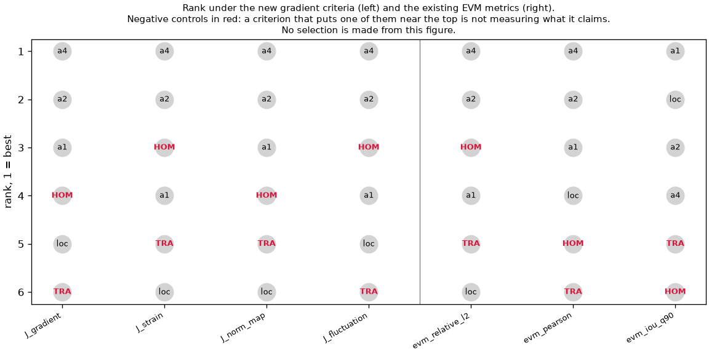
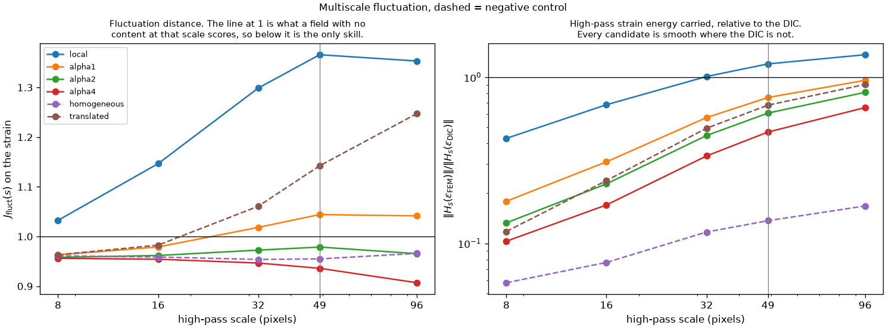

# Gradient-based fluctuation criteria — exploratory diagnostic

Date: 2026-08-01
Specification: short specification of 2026-08-01, "Critères de fluctuation
fondés sur les gradients de déplacement".
Machine-readable results:
`reference_data/gradient_fluctuation_criteria_p0043_v1/gradient_criteria_report.json`,
with `gradient_criteria_summary.csv` and `gradient_criteria_multiscale.csv`.

**Exploratory. No micromorphic parameter is selected, no candidate is declared
optimal, and nothing here says whether the nonlocal formulation works.** The v1
and v2 criteria sets are untouched and none of these criteria enters a Pareto
front. Archived fields only; no mechanics was rerun.

## Interpretation limit

Every archived high-fidelity solution compared here uses one fixed spatial
range, `ell = 58.88 um`, with `alpha` in `{0, 1, 2, 4}`. This is one slice of
the `(ell, alpha)` space.

> The parameterisations tested at fixed spatial range do not necessarily
> reproduce the global amplitude and the spatial fluctuations simultaneously.
> Other combinations of spatial range and feedback intensity remain possible.

## Short answer

Three findings, in order of importance.

1. **The homogeneous control is not rejected by any of the four specified
   criteria.** It ranks third or fourth of six on every one of them, ahead of
   `alpha = 1` on `J_strain` and on `J_fluct`. The specification requires this
   control to be penalised; it is not.
2. **The reason is structural, not incidental.** `J_fluct` saturates at about
   `1` for any field with no content at the scale considered, because the
   residual then reduces to the reference itself. Predicting nothing scores
   `~1`; predicting something in the wrong place scores `>1`. The criterion
   therefore rewards smoothness.
3. **The translated control is rejected**, cleanly and by every criterion. So
   the criteria do measure placement — they simply do not measure presence.

Two auxiliary quantities of section 4.3 behave better than the four main
criteria: the Pearson correlation of the gradient-norm map rejects both
controls, and the upper-quantile ratio shows an interior optimum where the
`L2` criteria are monotone.

## The registered separation of rotation and strain works

The check the specification makes mandatory, on the real DIC field:

| Synthetic case | `J_grad` | `J_strain` | `J_fluct` |
|---|---:|---:|---:|
| uniform displacement | `0` | `0` | `0` |
| **rigid rotation** | **`0.1186`** | **`1.8e-13`** | `4.1e-13` |
| affine strain | `0.1751` | `0.2047` | `3.3e-13` |
| amplitude `1.20` | `0.2000` | `0.2000` | `0.2000` |
| width change, sigma 8 px | `0.1990` | `0.2127` | `0.3781` |
| band merge, sigma 24 px | `0.2909` | `0.2878` | `0.5528` |
| band translation, 16 px | `0.3899` | `0.3912` | `0.7402` |
| band removal | `4.899` | `4.716` | `9.309` |

A rigid rotation moves `J_grad` by `0.119` and leaves `J_strain` at `1.8e-13`,
which is numerical zero. A uniform displacement changes nothing. An affine
offset moves `J_grad` and `J_strain` but is invisible to `J_fluct`, which is
what removing the domain-mean gradient is for.

Two caveats on this table. The amplitude case scales the whole gradient by
`1.20`, so `0.200` everywhere is arithmetic, not a measurement. And **band
removal is not comparable in magnitude with the others**: it zeroes the
fluctuation inside a hard-edged corridor, and the step at the mask boundary
dominates the score. Only its sign — heavily penalised — should be read.

## The four criteria on the archived candidates

| Case | `J_grad` | `J_strain` | `J_g` | `J_fluct` |
|---|---:|---:|---:|---:|
| local | `0.6443` | `0.5755` | `0.4794` | `1.2107` |
| alpha = 1 | `0.5067` | `0.4611` | `0.3211` | `0.9474` |
| alpha = 2 | `0.4710` | `0.4321` | `0.2882` | `0.8789` |
| alpha = 4 | `0.4415` | `0.4086` | `0.2729` | `0.8227` |
| **homogeneous** | `0.5093` | **`0.4378`** | `0.3949` | **`0.9338`** |
| **translated** | `0.6928` | `0.5709` | `0.4257` | `1.2553` |

**All four criteria are monotone in `alpha` over the tested range**, improving
from local through `alpha = 4`. None shows an interior optimum. Taken alone
they would push toward larger feedback with no turning point inside the tested
set — which says nothing about what happens outside it.

**The homogeneous control sits in the middle of the field.** On `J_strain` it
scores `0.4378`, better than `alpha = 1` at `0.4611` and close to `alpha = 2`
at `0.4321`. On `J_fluct` it scores `0.9338`, again better than `alpha = 1`.
A field that reproduces only the smooth background is not distinguished from a
coupled solution by the criteria meant to measure fluctuations.

The translated control is last or second to last everywhere, as it should be.



## Why the homogeneous control survives

The multiscale analysis explains it, and the explanation is structural.

`J_fluct(s)` alongside the high-pass strain energy each field actually carries,
relative to the DIC:

| Case | `J(8)` | `J(16)` | `J(32)` | `J(49)` | `J(96)` | energy `(8)` | energy `(96)` |
|---|---:|---:|---:|---:|---:|---:|---:|
| local | `1.032` | `1.147` | `1.299` | `1.366` | `1.353` | `0.429` | `1.367` |
| alpha = 1 | `0.963` | `0.979` | `1.018` | `1.044` | `1.041` | `0.179` | `0.959` |
| alpha = 2 | `0.958` | `0.962` | `0.973` | `0.979` | `0.966` | `0.133` | `0.812` |
| alpha = 4 | `0.956` | `0.954` | `0.947` | `0.936` | `0.907` | `0.103` | `0.657` |
| **homogeneous** | `0.961` | `0.959` | `0.954` | `0.955` | `0.966` | **`0.058`** | **`0.168`** |
| translated | `0.963` | `0.983` | `1.061` | `1.142` | `1.247` | `0.118` | `0.906` |



At `8 px` every candidate scores between `0.956` and `1.032` — a spread of
`8 %` across a set that includes a deliberately structureless control. **No
criterion has skill at fine scales.** The reason is on the right of the table:
at `8 px` the coupled fields carry `10` to `18 %` of the DIC's high-pass strain
energy, and the homogeneous control carries `5.8 %`. When a candidate has
almost no content at a scale, the residual is essentially the reference and the
score goes to `1` whatever the candidate does.

So `~1` is not a score, it is a floor — the value returned for predicting
nothing. The homogeneous control reaches it because it predicts nothing, and
`alpha = 1` sits at `0.963` because whatever it does predict is barely better
than nothing at that scale.

**A known confound is part of this.** The symmetric replay applies DISFlow's
spatial transfer to the FEM displacement but adds no speckle-decorrelation
noise, so the observed FEM is smoother than the DIC by construction. Part of
the missing fine-scale energy is missing measurement noise rather than missing
model content, and no part of this section should be read as model error at
`8` or `16 px`.

At `96 px` the criteria do separate: `alpha = 4` at `0.907`, then `alpha = 2`
and the homogeneous control tied at `0.966`, `alpha = 1` at `1.041`,
translated at `1.247`, local at `1.353`. Even at the coarsest scale, the
homogeneous control is not distinguished from `alpha = 2`.

## What the auxiliary quantities of section 4.3 add

These are the ones the specification asks to keep alongside `J_g`, and they
behave better than the four main criteria.

| Case | Pearson | Spearman | mean bias | q90 ratio | q95 ratio |
|---|---:|---:|---:|---:|---:|
| local | `0.629` | `0.541` | `+5.8e-05` | `1.262` | `1.360` |
| alpha = 1 | `0.702` | `0.635` | `-9.3e-05` | `1.124` | `1.106` |
| alpha = 2 | `0.722` | `0.669` | `-1.8e-04` | `1.055` | **`0.989`** |
| alpha = 4 | `0.741` | `0.697` | `-3.0e-04` | `0.949` | `0.874` |
| **homogeneous** | **`0.468`** | `0.552` | `-1.0e-03` | **`0.643`** | **`0.552`** |
| **translated** | **`0.417`** | `0.385` | `-6.8e-04` | `0.939` | `0.873` |

**The Pearson correlation of the gradient-norm map rejects both controls.**
The homogeneous control scores `0.468` and the translated control `0.417`,
against `0.629` for the worst model. This is the only quantity in the whole
specified set that separates both negative controls from every candidate.

**The upper-quantile ratio shows an interior optimum.** On q95, `alpha = 2` is
within `1.1 %` of the DIC while `alpha = 1` over-predicts by `10.6 %` and
`alpha = 4` under-predicts by `12.6 %`. The `L2` criteria are monotone toward
`alpha = 4` on the same data. **Amplitude at the top of the distribution and
overall fluctuation distance therefore disagree about the direction to move
in** — which is exactly the kind of disagreement worth registering, and exactly
what this study cannot resolve at one fixed spatial range.

Note also the mean bias: the homogeneous control has the largest, `-1.0e-03`,
so it is not a magnitude-neutral field. The `L2` fluctuation criteria still do
not penalise it.

## Comparison with the existing metrics

Recomputed on the same support, same mask:

| Case | EVM rel. L2 | EVM Pearson | EVM IoU q90 |
|---|---:|---:|---:|
| local | `0.486` | `0.604` | `0.309` |
| alpha = 1 | `0.354` | `0.651` | **`0.323`** |
| alpha = 2 | `0.320` | `0.658` | `0.309` |
| alpha = 4 | `0.292` | `0.664` | `0.255` |
| **homogeneous** | `0.336` | `0.460` | **`0.000`** |
| **translated** | `0.472` | `0.276` | `0.159` |

Answering the four questions the specification asks:

**Monotone in `alpha`**: `J_grad`, `J_strain`, `J_g`, `J_fluct`, EVM relative
L2 and EVM Pearson. All improve from `alpha = 1` to `alpha = 4`.

**Interior optimum**: the q95 ratio of the gradient-norm map, optimal at
`alpha = 2`. **IoU q90 is worse than monotone — it is inverted**, best at
`alpha = 1` (`0.323`) and worst of the three coupled runs at `alpha = 4`
(`0.255`). The metric that measures where the high strain sits prefers less
coupling; every amplitude metric prefers more.

**Rejects the negative controls**: EVM IoU q90 (homogeneous exactly `0`), EVM
Pearson, and the gradient-norm Pearson. **None of the four main gradient
criteria does.** EVM relative L2 does not either — the homogeneous control at
`0.336` beats `alpha = 1` at `0.354`, the same failure as `J_strain`.

**Disagreement between global amplitude and fluctuations**: yes, and it is the
main structural result. Increasing `alpha` improves every amplitude-like
criterion and degrades IoU q90; the q95 quantile ratio turns over at
`alpha = 2` while the L2 distances keep improving to `alpha = 4`.

## What this licenses, and what it does not

Permitted by the specification and supported here:

- `J_strain` and `J_fluct` **are sensitive to placement** — the translated
  control is rejected by all of them;
- they **do not reject a structureless field**, and the mechanism is understood:
  the fluctuation distance saturates at `1` for a candidate with no content, so
  absence is cheaper than misplacement;
- **a compromise appears between global amplitude and spatial content**, seen
  twice: IoU q90 against the L2 criteria, and the q95 ratio against `J_strain`;
- **two quantities deserve a later preregistration**: the Pearson correlation
  of the gradient-norm map, the only one separating both controls, and the
  upper-quantile ratio, the only one with an interior optimum. Any such
  preregistration should also register a presence criterion, since the failure
  documented here is a failure to penalise absence.

Explicitly not concluded, per the specification and per the evidence:

- no value of `alpha` is identified;
- no value of `ell` is identified — only one was tested;
- no candidate is optimal;
- nothing here validates the nonlocal formulation, and nothing here says it
  fails. The monotone improvement with `alpha` is measured on criteria that
  cannot distinguish a coupled solution from a smooth control, so it cannot
  carry that weight.

## Contract

One partition, `p0043`. Solve bounds `[1290, 1950, 780, 1390]`, core bounds
`[1440, 1800, 930, 1240]`, pixel `1.84 um`, mask `declared_all_valid`.
Differentiation is the historical EVM operator's: `np.gradient` with array axis
0 = canonical x, then `cell_average` to element centres. Fields are
differentiated on the solve grid and cropped afterwards, so no core point uses a
one-sided difference. High-pass filter `H_s(f) = f - G_s * f` with
`sigma = 0.5 s`, identical for every field, every scale and every candidate.
Scales `8, 16, 32, 49, 96 px`; `49` is the measured MTF-50 of the chain.

The DIC displacement comes from the prepared case; the FEM displacements are
`observed_flow_pixels.npy`, that is, the FEM as the image chain and DISFlow
actually see it, not the imposed nodal field.

## Reproduction

```python
from fem_inhouse.workflows.compare_gradient_fluctuation_criteria import (
    compare_gradient_fluctuation_criteria,
)
```
