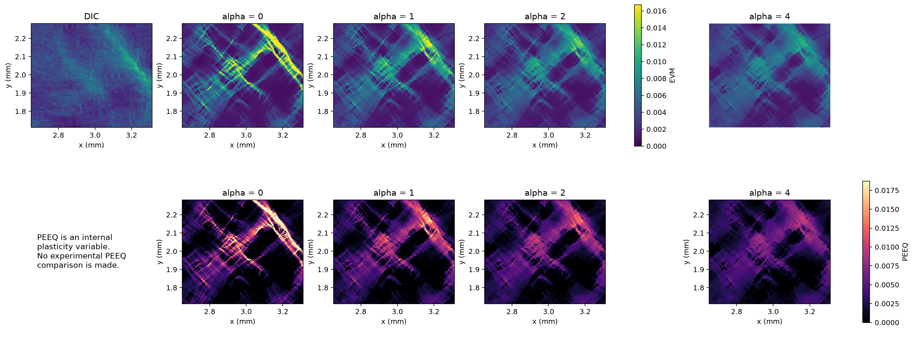

# P43 coupled-plasticity validation results

## Scope

This report records the pre-registered P43 sweep at fixed
\(\ell=58.88\,\mu\mathrm m\). The retained `360 x 310` core contains two
diagonal DIC deformation bands. Every mechanical solve used the padded
`660 x 610` domain, 20 increments, the native MFront plane-stress J2
behaviour, eight MFront threads, and the symmetric J2 PARDISO path.

The local core gives

```text
H_ref = 5168.147582748343 MPa
```

and the tested coupled moduli were \(H_\chi=\alpha H_\mathrm{ref}\), with
\(\alpha=1,2,4\). The comparisons use raw converged displacements and the
historical EVM reconstruction on the manifest-declared core. No Helmholtz
filter is applied to the compared FEM EVM.

## Mechanical runs

| Alpha | Hchi (MPa) | Wall time | Peak RSS | Newton | Nonlocal iterations | Cutbacks |
|---:|---:|---:|---:|---:|---:|---:|
| 0 | 0 | 15 min 43 s | 4,288,740 KiB | 129 | 0 | 0 |
| 1 | 5,168.148 | 26 min 40 s | 4,572,024 KiB | 172 | 577 | 0 |
| 2 | 10,336.295 | 29 min 56 s | 4,567,020 KiB | 202 | 616 | 0 |
| 4 | 20,672.590 | 36 min 14 s | 4,526,128 KiB | 249 | 679 | 0 |

All 20 increments converged for every campaign. The largest Gauss-point
plane-stress residual over the coupled sweep is `8.74e-14 MPa`; the largest
Helmholtz residual is `7.50e-13`; the largest relative constitutive-tangent
asymmetry is `7.11e-16`.

## Raw FEM-DIC comparison

| Alpha | Pearson r | Relative L2 | RMSE | top-10 IoU | DIC-q90 IoU | q90 active area |
|---:|---:|---:|---:|---:|---:|---:|
| 0 | 0.37910 | 0.95156 | 0.003988 | 0.20727 | 0.20418 | 17.80% |
| 1 | 0.46243 | 0.61739 | 0.002587 | 0.24304 | 0.24479 | 18.67% |
| 2 | 0.48136 | 0.52557 | 0.002203 | **0.24860** | 0.25765 | 17.46% |
| 4 | **0.50358** | **0.43413** | **0.001819** | 0.24616 | **0.26676** | 14.85% |

Every positive candidate passes the eight pre-registered acceptance checks.
Relative to the local calculation, alpha 4 increases correlation by `0.12448`,
reduces relative L2 by `54.38%`, and increases DIC-q90 IoU by `0.06258`.
Interior displacement error also decreases rather than degrading.

## Plastic-strain redistribution

| Alpha | PEEQ maximum | PEEQ mean | Standard deviation | Gradient RMS | Total variation |
|---:|---:|---:|---:|---:|---:|
| 0 | 0.06419 | 0.003080 | 0.004676 | 1.2731 | 0.2648 |
| 1 | 0.02194 | 0.002946 | 0.003136 | 0.7224 | 0.1806 |
| 2 | 0.01615 | 0.002876 | 0.002669 | 0.5790 | 0.1498 |
| 4 | 0.01161 | 0.002794 | 0.002164 | 0.4423 | 0.1165 |

The coupling strongly suppresses local peaks and spatial gradients while
changing the mean much less. This is the expected redistribution mechanism;
PEEQ is an internal variable and is not compared to an experimental PEEQ.

## Figures



The full output directory also contains common-scale EVM maps, signed
FEM-minus-DIC errors, PEEQ maps, empirical distributions, PDF/SVG exports, and
`plot_metadata.json` with campaign hashes and colour limits.

## Decision

P43 is a useful band-containing ROI: the coupled model improves every
pre-registered acceptance check, and the visual changes correspond to a
credible broadening rather than a simple rigid shift.

The sweep does **not** identify a unique coupling modulus. Alpha 4 is best for
correlation, relative L2, RMSE and DIC-q90 IoU, while alpha 2 is slightly best
for top-10 IoU. They are therefore non-dominated candidates, and alpha 4 is
still the upper bound of the tested range. In accordance with the
pre-registration, no larger alpha is launched retrospectively and no value is
frozen yet.

The length was fixed from the earlier diagnostic campaign. These results
validate the coupled mechanism at that length; they do not jointly identify
\(\ell\) and \(H_\chi\). A future two-parameter or held-out-partition protocol
must be pre-registered before claiming a material length.
