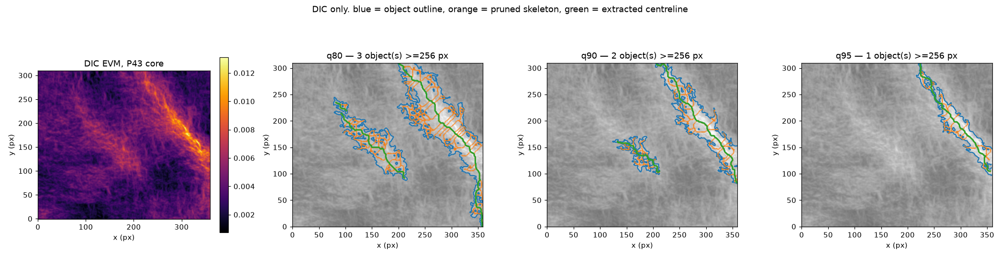

# Observed-EVM candidate comparison — preregistration

Date: 2026-07-31
Lot 5 of the observed-EVM comparison specification. **This document must be
validated before the campaign is run.** No candidate has been analysed with the
lot 2 to 4 tooling; nothing in this file is written after seeing its output.

## What is blind here, and what is not

Stated first because it limits what this preregistration can claim.

**Not blind.** The four candidates' *global* observed scores are already
archived in `dic_symmetric_observation_p0043_v1` and have been discussed:

| Case | relative L2 | q90 active fraction | top-10 % IoU |
|---|---:|---:|---:|
| local | `0.4858` | `0.1613` | `0.2987` |
| `alpha = 1` | `0.3542` | `0.1500` | `0.2890` |
| `alpha = 2` | `0.3197` | `0.1354` | `0.2817` |
| `alpha = 4` | `0.2917` | `0.1026` | `0.2527` |

Any bound chosen to sit just above or below one of these numbers would be
preregistration theatre. **No elimination bound below is derived from this
table.** Every bound comes from the measurement chain — its noise floor, its
resolution — or from a geometric property of the bands themselves.

**Blind.** Nothing per band, nothing multiscale, nothing bootstrapped has ever
been computed for these candidates. Band geometry, centreline error, the three
widths, continuity, FSS, residual structure, pairwise probabilities and the
Pareto front are all new. That is where this document has force.

## Candidates

| Label | Campaign | Role |
|---|---|---|
| `local` | `results/constitutive-local-p0043-pad150` | no coupling |
| `alpha1` | `results/constitutive-nonlocal-p0043-pad150-a100` | coupling candidate |
| `alpha2` | `results/constitutive-nonlocal-p0043-pad150-a200` | coupling candidate |
| `alpha4` | `results/constitutive-nonlocal-p0043-pad150-a400` | coupling candidate |
| `homogeneous` | `results/control-homogeneous-local-p0043-pad150` | negative reference, background |
| `translated` | `results/control-translated-maps-local-p0043-pad150` | negative reference, localisation |

All six are converged, share P43 with padding 150, 20 increments and the
proportional path.

**Excluded, deliberately.** The measured-history, proportional-40 and
modal-filtered runs of 2026-07-30 are *not* candidates. They differ in loading
path and increment count, and mixing them in would confound the constitutive
question with the path question. They are already known to be indistinguishable
on this observable; revisiting them is a separate campaign.

## Observation operator

`legacy_script_2021` primary, `declared_medium_v4` sensitivity, applied
identically to every candidate through `replay_dic_observation`. The raw
comparison is computed and archived as a **known-biased control** and never
used for selection.

Comparison support: the P43 core, `core_bounds = [1440, 1800, 930, 1240]`,
padding excluded. Identical mask, crop, EVM operator and non-finite policy for
every candidate.

## Band geometry, from the DIC alone

**The threshold that defines the geometry and the thresholds that define
"active" for the FSS are different things and are not the same here.** The
first version of this document left the geometry threshold unspecified, which
was a hole: it decides how many bands exist.

Geometry threshold: **q80**, fixed after a DIC-only measurement recorded in the
amendment below. Minimum object area
**256 px**, which is `4 x 64` — narrower than the `49 px` MTF-50 of the chain in
one direction, so no object the chain could not resolve survives, and it is not
tuned to any candidate.

Centreline: Zhang-Suen thinning, spur pruning at **16 px** (a third of the
MTF-50), Euclidean shortest path between extremities, moving-average smoothing
with window **9**, resampling every **4 px**.

Normal sections: half-length **40 px**, sampling step **1 px**, border margin
**4 px**. Corridor half-width **12 px**; the background is taken outside it.

**Manual assist.** Selecting which objects are "the two bands" may be done once,
by hand, **with no candidate field visible**. The chosen identifiers and the
resulting mask are versioned. This is the one human step and it belongs to the
project owner, not to the analysis.

## Metrics

Per band and per section: background level and spread, peak and centroid
position, FWHM, integral width, second-moment width with their statuses, peak,
q95, mass, corridor mean, profile correlation, normalised L1 and L2, asymmetry.
Per band: detected fraction, detected length, gap count, longest gap.
Summaries always report median, IQR, p90, **worst decile**, valid and missing
fractions — never a mean alone.

Widths are reported three ways with **none preferred**.

FSS at q80, q90 and q95, thresholds from the DIC applied to the candidate
unchanged, at scales **1, 2, 4, 8, 16, 24, 32, 48, 64, 96 px**, with the first
scale attaining 0.5, 0.7 and 0.9.

Residual: signed map on a common scale, corridor and background energy, radial
spectrum, directional variograms, associations with the reference and its
**signed** derivatives, and the heuristic typology, labelled as a diagnostic.

## References

- **positive**, the chain's own reproducibility: the repeated final pair gives a
  spurious EVM RMS of `1.363e-4`, that is `4.52 %` of the final DIC EVM RMS.
  This is chain reproducibility, **not** full experimental uncertainty;
- **negative, background**: `homogeneous`;
- **negative, localisation**: `translated`.

Normalised skill is reported alongside raw distances, never instead of them.

## Bootstrap

Paired block bootstrap over sections. Block length **8 sections** (`32 px`,
below the `38.2 px` DIC coherence length so blocks are not artificially
independent), sensitivity at **4** and **16**. Draws **10 000**, seed
**20260731**. Bands resampled separately, averaged at equal weight.

Decision vocabulary at the registered thresholds: `> 0.95` robustly better,
`0.80`–`0.95` probably better, `0.20`–`0.80` indistinguishable, `0.05`–`0.20`
probably worse, `< 0.05` robustly worse.

A conclusion that does not hold at all three block lengths is reported as
scheme-dependent, not as a result.

## Amendment before validation, 2026-07-31

Three changes, made before the campaign is run and before any candidate is read
with the lot 2 to 4 tooling.

### 1. The geometry threshold is q80, chosen on a DIC-only measurement

Segmenting the DIC alone at the three thresholds, minimum area 256 px:

| Threshold | Objects | Second band |
|---|---:|---|
| q80 | 3 | full length, `5639 px`, centreline `175 px` |
| q90 | 2 | reduced to its core, `1666 px`, centreline `111 px` |
| q95 | **1** | **absent** |

At q95 the two-band premise of section 3.4 collapses outright. At q90 the second
band survives only as a fragment, and every worst-band conclusion would rest on
it. **q80 is the only threshold at which both bands exist over their full
length.** The third q80 object, `361 px` with a `26 px` centreline, is what the
manual selection is there to discard.

No candidate field was read to reach this. q80, q90 and q95 all remain in use as
FSS activity thresholds, which is a different question.

Blue outlines the objects, orange the pruned skeleton, green the extracted
centreline.

### 2. The skeletons are networks, not ribbons

Pruning saturates at about `26 %` of skeleton pixels on the main path and stops
changing beyond `32 px`, tested to `128 px`. The surviving branches are
therefore **loops**, which endpoint pruning cannot remove by construction.

The extracted centreline remains the band axis, which is what normal sections
need, but it does **not** summarise the object's topology. Any statement about
band length or connectivity must come from the object, not from the centreline.

### 3. E5 is demoted, and the FSS criterion is replaced

- **E5 is no longer an elimination criterion.** The q90 active fractions are
  already known, and a non-blind criterion must not be able to eliminate a
  candidate on a number known in advance. It is computed and reported.
- **The Pareto FSS criterion becomes the minimum scale reaching FSS 0.7 at
  q90**, lower is better, replacing FSS at a fixed 16 px. The fixed scale was an
  unjustified choice; the attaining scale is the natural summary of the curve.
  A candidate never reaching 0.7 returns `nan` and is reported as such rather
  than ranked.

## Elimination criteria

Each bound and its origin. **None is derived from the archived score table.**

| # | Criterion | Bound | Origin of the bound |
|---|---|---|---|
| E1 | campaign converged, plane-stress residual valid | as archived | solver contract |
| E2 | each DIC band detected in at least half its sections | `0.50` | below half, "the band is reproduced" is not defensible in plain language |
| E3 | median centreline error smaller than the DIC median integral width | band's own width | a band displaced by more than its own width is a different band |
| E4 | no spurious band of area above the minimum object area inside the core and outside every corridor | `256 px` | same resolution bound as E |
E1 to E4 have **never been computed** for any candidate.

E5, the q90 active fraction, was an elimination criterion in the first version
and is **withdrawn** to reported-only status by the amendment above: the active
fractions are already known, and a non-blind criterion must not decide.

## Pareto criteria

A reduced, non-redundant set. Amplitude, position, width, morphology and
continuity each enter once:

| Criterion | Sense |
|---|---|
| integrated mass error, worst band | lower is better |
| median centreline error, worst band | lower is better |
| median integral-width error, worst band | lower is better |
| minimum scale reaching FSS 0.7 at q90 | lower is better |
| corridor fraction of residual energy | lower is better |
| detected fraction, worst band | higher is better |

Every one is taken on the **worst band**, as a vector, never summed. No
weighted sum is formed at any point.

## Interpretation rules

- a candidate is eliminated, dominated, non-dominated, or statistically
  indistinguishable from another. Those are the only verdicts;
- **no winner need exist.** "Several non-dominated" and "no candidate passes"
  are results;
- the primary profile decides; a disagreement with the sensitivity profile is
  reported, never averaged away;
- the `16 %` loading-path systematic on core PEEQ applies uniformly and is
  cited; it is not applied as a correction;
- **no micromorphic parameter is selected by this campaign**, whatever the
  front looks like. Selecting one needs the separately registered
  identification campaign.

## Figures

`dic_and_observed_candidates`, `signed_residuals`, `band_centerlines`,
`normal_profiles_band_<id>`, `width_along_band_<id>`,
`position_error_along_band_<id>`, `fss_heatmaps`, `fss_curves`,
`residual_autocorrelation`, `residual_spectra`, `pareto_matrix`,
`pairwise_probability_matrix`, `falsification_metric_response`.

Every multi-candidate figure uses a common scale.

## Failure conditions

Registered in advance, each a legitimate outcome rather than a defect:

1. **no candidate passes E1 to E5** — reported, and the campaign stops;
2. **the Pareto front holds more than half the candidates** — the criteria do
   not discriminate at this resolution; reported, no ranking published;
3. **the two profiles disagree on a verdict** — reported as profile-dependent;
4. **a conclusion holds at only one block length** — reported as
   scheme-dependent;
5. **the falsification bench mis-ranks a registered defect order** — that metric
   is withdrawn from the decision before any candidate is read.

## Claim boundary

Agreement of an observed EVM field. Nothing about internal stresses, nothing
about PEEQ, which is not a DIC observable. One ROI, one test, one loading path;
a non-dominated candidate is not thereby identified, and no transferable
material internal length follows from any outcome here.

## Deliverable

`validation/observed_evm_candidate_comparison_results.md` and
`reference_data/observed_evm_candidate_comparison_p0043_v1/`, in a **separate
commit** from this one.
