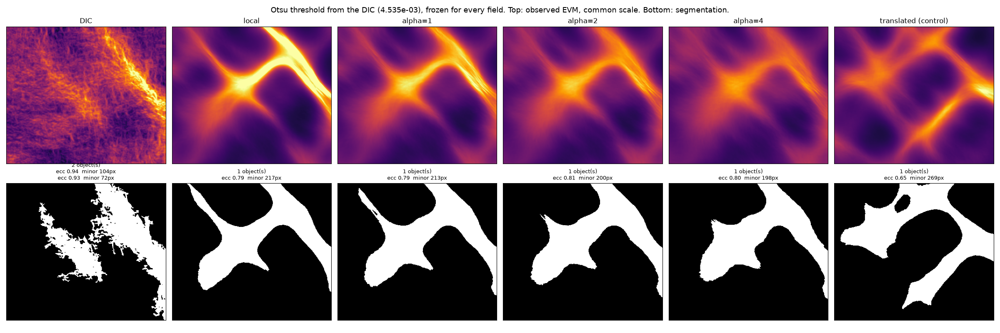

# Observed-EVM candidate comparison — results

Date: 2026-07-31
Preregistration:
`observed_evm_candidate_comparison_preregistration.md`, validated 2026-07-31
including both amendments.
Machine-readable result:
`reference_data/observed_evm_candidate_comparison_p0043_v1/report.json`.

Archived fields only. No mechanics was run, no material parameter selected, no
archived result modified.

## Short answer

**Registered failure condition 2 fires: the criteria do not discriminate.**
Five of six candidates are non-dominated, and among them is the translated-map
negative control, which is there precisely to be rejected.

The scientifically important finding is separate from that and is not a
failure: **no candidate reproduces the two-band morphology of the DIC.** All
four produce a single merged object where the DIC has two, with a minor axis
about twice as large.

## Segmentation

Otsu on the DIC gives `4.53523e-03`. It is frozen and applied unchanged to
every field. Two bands survive the automatic selection rule:

| Band | Area | Centreline | Sections |
|---|---:|---:|---:|
| band1 | `17 830 px` | `402 px` | 94 |
| band2 | `8 340 px` | `279 px` | 63 |

## Morphology: every candidate merges the two bands

| Field | Active | Objects | Eccentricity | Minor axis | Orientation error |
|---|---:|---:|---:|---:|---:|
| **DIC** | `26.2 %` | **2** | `0.942`, `0.935` | `104`, `72 px` | — |
| local | `24.1 %` | 1 | `0.794` | `217 px` | `71.9 deg` |
| alpha = 1 | `24.9 %` | 1 | `0.790` | `213 px` | `72.2 deg` |
| alpha = 2 | `24.4 %` | 1 | `0.806` | `200 px` | `75.6 deg` |
| alpha = 4 | `23.8 %` | 1 | `0.797` | `198 px` | `73.4 deg` |
| homogeneous | `0.0 %` | **0** | — | — | — |
| translated | `27.0 %` | 1 | `0.645` | `269 px` | `42.4 deg` |

Three things stand out.

**The active fraction is useless here.** Every candidate sits within three
points of the DIC, and so does the negative control. Any area-based score would
call them all comparable.

**Every candidate merges the two bands into one.** The DIC's two objects have
eccentricity above `0.93` and minor axes of `104` and `72 px`. Every candidate
gives one object of eccentricity about `0.79` and a minor axis around `200 px`:
roughly twice as wide, and connected where the DIC is separated. The large
orientation errors, `72` to `76` degrees, are a symptom of that merge rather
than an independent defect: the principal axis of a merged X-shaped region has
no relation to either band.

**Coupling does not fix it.** From `alpha = 1` to `alpha = 4` the minor axis
falls from `213` to `198 px`, against a DIC value of `104`. The trend is in the
right direction and far too small to close the gap.



The figure also shows a texture difference: the DIC is finely speckled, every
FEM field is smooth. **This is not evidence of model error.** The symmetric
replay applies DISFlow's spatial transfer to the FEM displacement but adds no
speckle-decorrelation noise, so the observed FEM stays smoother than the DIC by
construction. Only the band-scale geometry is comparable here.

## The negative control is not rejected by the registered criteria

The homogeneous control is eliminated correctly, by the registered E2: it
carries a band in `42.9 %` of valid sections, below the `50 %` bound. The method
catches a field with no bands.

The translated-map control is not eliminated, and survives as non-dominated:

| Candidate | detection | centreline err | width err | mass err | min FSS scale | corridor energy |
|---|---:|---:|---:|---:|---:|---:|
| local | `0.984` | `19.93` | `3.64` | `0.0823` | `64` | `0.157` |
| alpha = 1 | `1.000` | `18.64` | `5.64` | `0.0346` | `64` | `0.178` |
| alpha = 2 | `0.977` | `16.98` | `6.19` | `0.0245` | `64` | `0.209` |
| alpha = 4 | `0.968` | `16.85` | `7.05` | `0.0378` | `96` | `0.271` |
| homogeneous | `0.429` | `16.65` | `4.69` | `0.0731` | — | `0.499` |
| **translated** | `0.905` | `16.92` | `5.95` | `0.0260` | `96` | `0.262` |

On centreline error, width error and mass error the translated control is
**inside the range of the coupled candidates**. On the paired bootstrap, its
mass error is statistically **indistinguishable** from `alpha = 1`
(`P = 0.391`) and from `alpha = 4` (`P = 0.610`).

That control was built by displacing the material maps while preserving their
distributions. A criteria set that cannot separate it from a coupled model is
not measuring placement.

**Why it survives, and what that means.** The morphology block separates it
immediately: eccentricity `0.645` against `0.79`, minor axis `269` against
`200 px`, orientation error `42` against `72` degrees. But **morphology is not
in the registered Pareto criteria**, which are all section-based. The
registered criteria set is therefore insufficient, and the negative control is
what proved it.

This is recorded as a finding, not repaired. Adding morphology to the Pareto
set now, after seeing that it would change the answer, would be exactly the
post-hoc tuning this protocol exists to prevent. A revised criteria set belongs
in a new preregistration.

## Paired bootstrap

Block length 8 sections, 10 000 draws, seed `20260731`, bands resampled
separately at equal weight. On mass error, block 8:

| Comparison | P(first better) | Decision |
|---|---:|---|
| alpha1 vs local | `1.000` | robustly better |
| alpha2 vs local | `1.000` | robustly better |
| alpha4 vs local | `1.000` | robustly better |
| alpha2 vs alpha4 | `0.937` | probably better |
| alpha1 vs alpha2 | `0.035` | robustly worse |
| alpha2 vs translated | `0.845` | probably better |
| alpha1 vs translated | `0.391` | indistinguishable |
| alpha4 vs translated | `0.610` | indistinguishable |

Coupling robustly improves integrated mass against the local model, which is
consistent with the archived global scores. It does not separate from the
displaced-map control.

## Pareto

Survivors after E2: `local`, `alpha1`, `alpha2`, `alpha4`, `translated`. **All
five are non-dominated; nothing dominates anything.** Each wins on at least one
criterion: `local` on width error and corridor energy, `alpha1` on detection,
`alpha2` on mass error, `alpha4` on centreline error, `translated` on
competitive mass and centreline error.

Five of six is above the registered half-the-candidates bound, so failure
condition 2 fires and **no ranking is published**.

## Two defects found by running, both fixed before these numbers

Recorded because they would have produced a confident wrong answer.

**The detection criterion was vacuous.** A section counted as carrying a band
when its excess was positive, which is true of almost any profile since the
background is a median of the tails. Detection is now "the excess peak exceeds
three times the chain's own reproducibility", `4.089e-4`, from the measured
spurious EVM RMS.

**Validity was conflated with detection.** A section leaving the support was
counted as "band absent". Band 1 runs corner to corner, so at a half-length of
`40 px` only `43` of its `94` sections stay inside the core, and **the DIC
scored `0.46` against its own band**. That self-check is the correctness
criterion: with validity separated, the DIC detects its own bands in `100 %` of
valid sections. Detection is now measured over valid sections and the valid
fraction is reported separately.

Neither fix was chosen to make a candidate pass. The second was forced by the
reference failing its own test.

## What this licenses

- **no micromorphic parameter is selected.** The registered protocol forbids it
  and the front is degenerate anyway;
- the archived global ranking is not contradicted: coupling does improve
  amplitude and mass, robustly, against the local model;
- **the two-band morphology is reproduced by none of the candidates**, which is
  new and does not depend on the criteria-set defect;
- the criteria set needs revising before any decision rests on it, and that
  revision must be registered before it is run.

## Claim boundary

One ROI, one loading path, one constitutive family, an observed EVM field.
Nothing about internal stresses, and PEEQ is not a DIC observable. The smooth
appearance of the FEM fields relative to the DIC is an artefact of the replay
adding no measurement noise, and is not counted as model error anywhere above.

## Reproduction

```python
from fem_inhouse.workflows.compare_observed_evm_candidates import (
    compare_observed_evm_candidates,
)
```

with the six archived observed-EVM fields, output into
`validation/reference_data/observed_evm_candidate_comparison_p0043_v1`.
