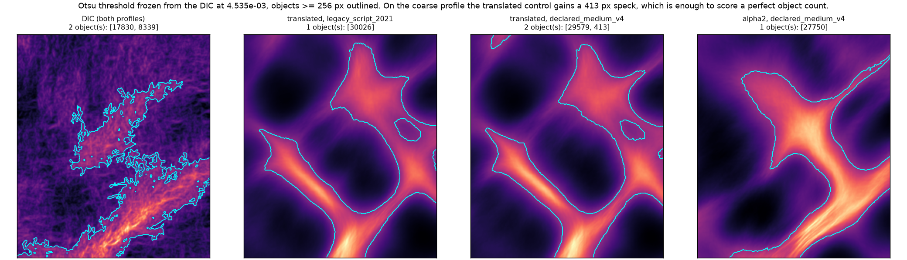

# Observed-EVM comparison, criteria set v2 with morphology — results

Date: 2026-08-01
Preregistration: `observed_evm_morphology_criteria_preregistration.md`,
validated 2026-08-01 including both amendments.
Machine-readable results:
`reference_data/observed_evm_morphology_criteria_p0043_v1/legacy_script_2021/report.json`
and `.../declared_medium_v4/report.json`.

Archived fields only. No mechanics was run, no material parameter selected, no
archived result modified.

## Short answer

**Registered failure conditions 3, 4 and 5 fire. No ranking is published.**

The primary profile gives a clean answer: `alpha = 2` alone non-dominated, the
translated control dominated, acceptance test passed. **The blind profile
refuses it**: all five survivors non-dominated, the translated control among
them, acceptance test failed.

The criteria set v2 is **not validated**. It passes the acceptance test on the
profile whose morphology was already known when the criteria were chosen, and
fails it on the profile that had never been through this pipeline. That is
precisely the comparison the blind confirmation was registered to make, and it
came out against the criteria.

## Gate G1 — two of the seven criteria order known defects backwards

Identical verdicts on both profiles.

| Criterion | Kendall tau | Verdict |
|---|---:|---|
| worst centreline error | `+0.857` | kept |
| object-count error | `+0.750` | kept |
| eccentricity error | `+0.556` | kept |
| minimum skilful scale q90 | `+0.500` | kept |
| worst mass error | `+0.286` | kept |
| **`abs(log)` minor-axis ratio** | `−0.111` | **removed** |
| **corridor energy fraction** | `−0.286` | **removed** |

**The minor-axis ratio is blind to translation.** A `16 px` shift moves it by
`0.0079`; a `10 %` amplitude change moves it by `0.335`, forty times more. It
is a width descriptor, and translating a band does not change its width. Ranking
a shift as forty times less serious than a small amplitude error is exactly the
inversion G1 is for.

**The corridor energy fraction scores a spurious band as the best case of the
whole ladder**, `0.218`, below every other defect including a `10 %` amplitude
error at `0.293`. A band the reference does not contain deposits its energy
*outside* the corridors, which lowers the corridor fraction. The criterion
rewards the defect.

One of the two removed criteria is a morphology criterion chosen for this very
campaign. The gate deleted it before any candidate was scored, which is the
only reason its removal is not post-hoc.

The `band_removed` case removes the union of both band masks, so it is "all
bands removed"; the minor-axis ratio is undefined there and that case drops out
of its tau.

## Gate G2 — passed on both profiles

The DIC against itself gives zero object-count error, zero eccentricity error,
zero centreline error, zero mass error, a minimum skilful scale of `1 px` and
detection in `100 %` of valid sections. The corridor energy fraction is
undefined, which is correct: a field compared with itself has no residual to
partition.

G2 passes only because amendment 2 redefined the centreline criterion as a
paired difference. v1's absolute offset is not zero for the DIC against itself.

## Primary profile — `legacy_script_2021`

Otsu on the DIC gives `4.53523e-03`, frozen. Two bands, `17 830` and `8 340 px`.
The homogeneous control is eliminated by both E2 (`0.429` detected) and E3 (no
object). Active criteria after G1, five of seven:

| Candidate | obj-count err | ecc err | centreline | mass | FSS q90 |
|---|---:|---:|---:|---:|---:|
| local | 1 | `0.148` | `17.50` | `0.0823` | `64` |
| alpha = 1 | 1 | `0.153` | `15.47` | `0.0346` | `64` |
| **alpha = 2** | 1 | `0.137` | `13.94` | `0.0245` | `64` |
| alpha = 4 | 1 | `0.145` | `14.22` | `0.0378` | `96` |
| translated | 1 | `0.297` | `15.79` | `0.0260` | `96` |

`alpha = 2` dominates all four others. The translated control is dominated,
mainly on eccentricity, `0.297` against `0.137`. **Acceptance test passed.**

Taken alone this profile would say the criteria set works and the coupled model
at `alpha = 2` is the single non-dominated candidate.

## Blind profile — `declared_medium_v4`

| Candidate | obj-count err | ecc err | centreline | mass | FSS q90 |
|---|---:|---:|---:|---:|---:|
| local | 1 | `0.150` | `18.72` | `0.1049` | `64` |
| alpha = 1 | 1 | `0.157` | `17.02` | `0.0356` | `64` |
| alpha = 2 | 1 | `0.150` | `16.65` | `0.0223` | `96` |
| alpha = 4 | 1 | `0.139` | `15.11` | `0.0386` | `96` |
| **translated** | **0** | `0.191` | `21.61` | `0.0239` | `96` |

**All five are non-dominated. The translated control is not dominated.**
Acceptance test failed.

Two things changed. `alpha = 2` loses the minimum skilful scale, `64` to `96`,
so it no longer dominates `alpha = 1`. And **the translated control scores a
perfect object count**.

## Why the object count flips, and why that condemns the criterion



Under the coarse profile the translated control produces two objects: one of
`29 579 px` and one of **`413 px`**, minor axis `17.5 px`. The DIC's second band
is `8 340 px` with a minor axis of `72 px`. The control matches the DIC's object
count with a speck twenty times too small, barely above the registered `256 px`
floor, in a corner of the ROI.

**A raw object count is not a morphology descriptor.** It counts connected
components without asking whether they resemble anything, so a fragment just
over the area floor buys a perfect score on the criterion meant to capture the
two-band structure. The criterion is gameable, and the negative control gamed
it — which is what negative controls are for.

This is not repaired here. Any fix — matching objects by size before counting
them, raising the floor, weighting by area — would be chosen knowing what it
does to this control, and belongs in a v3 preregistration.

## The blind set is less independent than the design assumed

The two profiles share their reference. `dic_evm.npy` is **byte-identical**
across them, SHA-256 `f8cde6b0…`, because the DIC EVM is reconstructed from the
measured displacements of the prepared case and never passes through DISFlow.
Only the FEM observation differs.

So the registered Otsu recomputation on the second profile was a **no-op**: same
DIC, same threshold `4.53523e-03`, same two bands. The blind confirmation
therefore tests the criteria against a change in the observation of the
candidates only, not against an independent measurement of the reference. It is
still blind in the sense that mattered — those numbers had never been computed —
but it is a weaker test than the preregistration implied, and the disagreement
it produced would only have been larger with an independent reference.

## Bootstrap

Block 8, 10 000 draws, seed `20260731`, on mass error. Consistent across
profiles, and it does not rescue the control:

| Comparison | legacy | v4 |
|---|---:|---:|
| alpha2 vs local | `1.000` robustly better | `1.000` robustly better |
| alpha1 vs alpha2 | `0.035` robustly worse | `0.015` robustly worse |
| alpha2 vs alpha4 | `0.937` probably better | `0.996` robustly better |
| **alpha2 vs translated** | `0.845` probably better | `0.895` probably better |
| **alpha1 vs translated** | `0.391` indistinguishable | `0.461` indistinguishable |
| **alpha4 vs translated** | `0.610` indistinguishable | `0.543` indistinguishable |

On integrated mass, the displaced-map control is still indistinguishable from
two of the three coupled candidates, on both profiles. `alpha = 2` never
separates from it robustly. The v1 finding stands: mass error does not measure
placement.

## What this licenses

- **no ranking, and no micromorphic parameter selected.** Conditions 3, 4 and 5
  all fire, and the preregistration forbids selection regardless;
- **the criteria set v2 is not validated.** Its acceptance test passes only on
  the non-blind profile;
- **G1 works and is not a rubber stamp.** It removed two of seven criteria,
  including one of the three morphology criteria chosen for this campaign;
- **the object-count criterion is defective** in a specific, diagnosed way: it
  is satisfiable by a `413 px` fragment;
- the archived global ranking is untouched: coupling remains robustly better
  than the local model on integrated mass, on both profiles;
- the v1 finding that **no candidate reproduces the two-band morphology** is
  confirmed and sharpened — the one candidate that matched the count did so with
  a speck.

## What the non-blindness cost

The preregistration said the blind confirmation was where the non-blindness of
the criteria set would be paid for. It was. Had the campaign run on the primary
profile alone, it would have reported a single non-dominated candidate and a
rejected negative control — a clean, publishable, and wrong conclusion. The
registered blind set is the only reason that is not what this document says.

## Claim boundary

One ROI, one loading path, one constitutive family, an observed EVM field. Two
DISFlow profiles sharing one reference. Nothing about internal stresses, and
PEEQ is not a DIC observable. The FEM fields are smoother than the DIC because
the replay adds no speckle-decorrelation noise; that texture difference is not
counted as model error anywhere above.

## Reproduction

```python
from fem_inhouse.workflows.compare_observed_evm_morphology import (
    compare_observed_evm_morphology,
)
```

with the six archived observed-EVM fields of each profile. The two negative
controls are in `reference_data/observed_evm_controls_p0043_v1/`, including the
`declared_medium_v4` re-observations produced for this campaign by replaying the
archived control displacement grids — no mechanics rerun.
