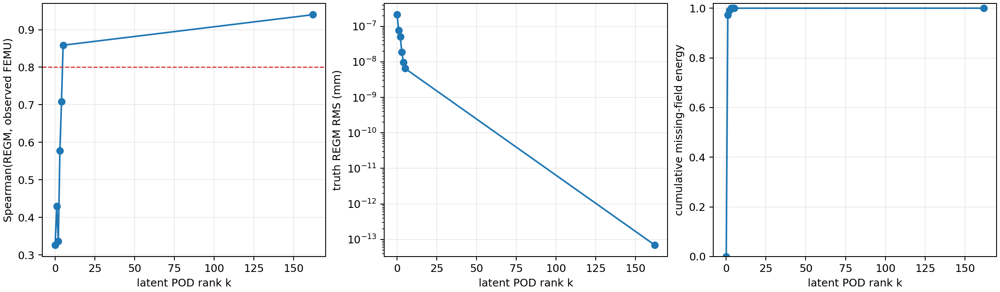

# SRIX-REGM latent kinematic modes — twin result

The experiment uses the exact M8 mechanical twin and no new FEMU forward
solves. The missing history `u* - O(u*)` is decomposed by snapshot POD. Rank
`k` is added back to the transferred history before the causal SRIX replay;
the pseudo-displacement is scored with the same affine-preserving observation
operator as the observed FEMU target.

| rank `k` | missing-field energy recovered | truth REGM RMS (mm) | Spearman | log-Pearson | top-5 |
|---:|---:|---:|---:|---:|---:|
| 0 | 0.000000 | `2.132e-7` | 0.326 | 0.276 | 2/5 |
| 1 | 0.972427 | `7.768e-8` | 0.430 | 0.381 | 3/5 |
| 2 | 0.991001 | `5.092e-8` | 0.337 | 0.331 | 2/5 |
| 3 | 0.999549 | `1.869e-8` | 0.577 | 0.610 | 2/5 |
| 4 | 0.999792 | `9.669e-9` | 0.708 | 0.764 | 2/5 |
| 5 | 0.999897 | `6.532e-9` | 0.859 | 0.888 | 4/5 |
| 162 | 1.000000 | `6.930e-14` | 0.940 | 0.941 | 4/5 |

The transition is not monotone mode by mode, but rank five is already enough
to pass the descriptive ranking thresholds used in the previous gate. The
result supports a low-dimensional latent-history hypothesis on this twin.

It is not yet a real-data method: the POD basis and coefficients use the exact
mechanical history `u*`. This experiment is therefore an upper-bound and a
design test. The next gate must construct the weak-mode basis without access to
the unknown true displacement, then repeat the twin transfer/noise test.

Primary artefact:
`validation/reference_data/srix_regm_latent_modes_v1/report.json`.
