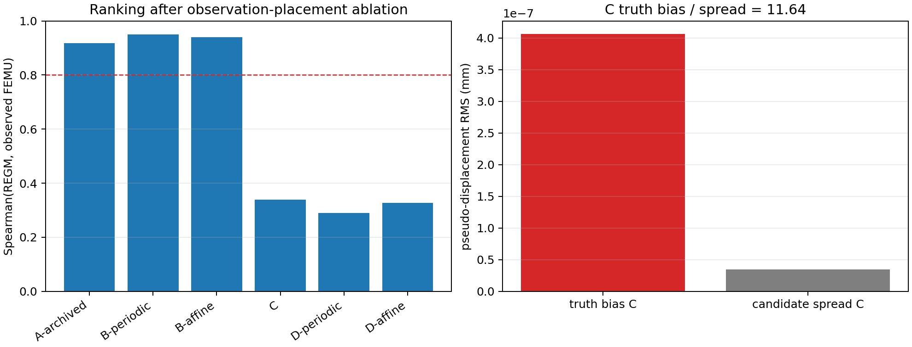

# SRIX-REGM observation-placement ablation

Date: 2026-08-24

The experiment reuses the 20 candidates from the frozen exact and observed
ranking campaigns. No new nonlinear mechanical forward solve was launched.
The comparison target is the archived observed full-FEMU ranking (`T1_transfer`).

## Result

| Variant | Replay history | Score transfer | Spearman | log-Pearson | top-5 overlap |
|---|---|---|---:|---:|---:|
| A-archived | raw exact twin | identity | 0.917 | 0.916 | 4/5 |
| B-periodic | raw exact twin | periodic FFT | 0.950 | 0.947 | 4/5 |
| B-affine | raw exact twin | affine-preserving | 0.940 | 0.941 | 4/5 |
| C | affine-preserving transfer | identity | 0.338 | 0.282 | 2/5 |
| D-periodic | affine-preserving transfer | periodic FFT | 0.290 | 0.243 | 2/5 |
| D-affine | affine-preserving transfer | affine-preserving | 0.326 | 0.276 | 2/5 |

The two B variants retain the ranking. The two D variants fail in the same
way as the archived observed experiment, and C already fails before any
observation is applied to the pseudo-displacement. The drop therefore occurs
when the transferred displacement is differentiated and replayed through the
nonlinear SRIX history, not when the correction is scored through `O`.

## Truth-centering diagnostic

At the true SRIX parameters, C produces a pseudo-displacement trajectory RMS
of `4.067e-7 mm`. The RMS spread of the same scalar trajectory over the 20
off-truth candidates is `3.495e-8 mm`, giving a bias-to-spread ratio of
`11.64`. Passing a mechanically equilibrated exact displacement through the
observation transfer therefore creates a larger pseudo-equilibrium signal than
the candidate-to-candidate parameter signal in this twin.

## Interpretation

The previous NO-GO remains valid for the current observed-input REGM
formulation, but its diagnosis is now sharper:

> `O` applied to the pseudo-displacement is not the dominant failure. Feeding
> `O(u*)` into the constitutive replay is.

This does not yet provide a usable latent-displacement reconstruction for real
P43. It does justify the next methodological step: retain the latent/mechanical
kinematics in the constitutive replay on twins, and design a separately
qualified latent-state reconstruction for experimental data. No P43 parameter
identification is authorized by this result.

Primary machine-readable source:
`validation/reference_data/srix_regm_observation_placement_v1/report.json`.
