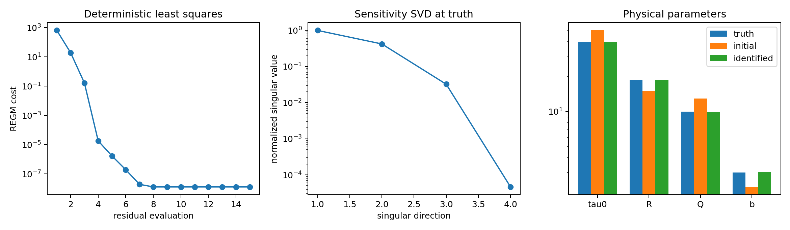

# SRIX-REGM exact-twin result

Date: 2026-08-23  
Evidence: `validation/reference_data/srix_regm_twin_v1/report.json`  
Source commit: `7fa920c11b56d5fee7010b7187d99ad4e5aaa0a2` (clean)

## Result

The exact M8 digital-twin gate passes. A full nonlinear SRIX solve generated
the displacement history; REGM then received only that history, the prescribed
orientations and the same constitutive preset.

| Quantity | Result |
|---|---:|
| accepted forward steps | 338 |
| full forward time | 124.48 s |
| one REGM evaluation | 2.90 s |
| measured speed-up | 43.0 x |
| REGM RMS at truth | 1.474e-13 mm |
| REGM RMS at frozen initial point | 3.143e-8 mm |
| REGM RMS after identification | 1.412e-13 mm |
| identifiable-space log error RMS | 0.248 % |

The REGM evaluation contains no global Newton or Krylov solve. Its measured
breakdown at the truth is 2.731 s in constitutive replay, 0.082 s in weak
assembly, 0.044 s in the already-factorised `K0^-1` actions and 0.000061 s in
the identity observation. Material replay is therefore the dominant cost.

## Parameter recovery

| Parameter | Truth | Initial | Identified |
|---|---:|---:|---:|
| `tau0` (MPa) | 40.0000 | 50.0000 | 39.99999 |
| `R` (MPa) | 18.78191 | 15.02553 | 18.78192 |
| `Q` (MPa) | 10.0000 | 13.0000 | 9.96517 |
| `b` | 3.0000 | 2.2500 | 3.01058 |

The result is the recovery of a known synthetic truth, not an identification
of 316L from P43.

## Sensitivity and identifiability

The singular values in descending order are:

```text
3.5811e-6, 1.5112e-6, 1.1602e-7, 1.6641e-10
```

The numerical rank is four at the preregistered relative threshold `1e-6`, but
the condition number is `2.15e4`. The two dominant directions mix `tau0` and
`R`. The third direction is approximately the same-sign combination of `Q`
and `b`; the weakest direction is approximately their difference. All four
pre-registered `+/- 0.05` log-direction probes increase the objective, but the
fourth does so only very weakly. It must therefore be expected to disappear
first after DIC transfer and noise.

The central finite-difference Jacobian is stable: the relative change between
log steps `3e-3` and `1e-3` is 0.459 %. The retained step is `3e-3`.

## Interpretation and gate decision

- **Passed:** truth is at the numerical floor, every retained singular
  direction is locally detectable, and deterministic least squares returns to
  the true valley from the frozen perturbation.
- **Supported:** exact, noiseless kinematics can distinguish four directions
  on this deliberately heterogeneous path.
- **Not demonstrated:** that all four directions survive the DIC observation
  chain or noise, or that REGM ranks parameter sets like a full FEMU.
- **Decision:** proceed to transfer/noise and REGM/FEMU ranking gates; P43
  remains forbidden until the ranking gate passes.



